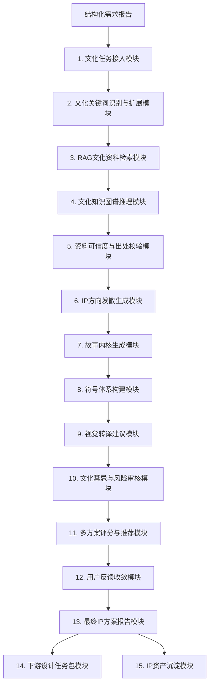
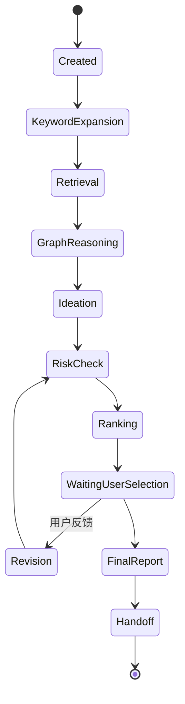

# 文化 IP 设计师 Agent 详细功能文档

## 1. 文档目的

本文档用于细化“文化产品智能工厂”系统中的文化 IP 设计师 Agent 功能模块。该 Agent 负责基于需求分析师 Agent 输出的结构化需求报告，完成文化关键词识别、文化资料检索、知识图谱推理、故事创意生成、符号体系构建、文化风险审核、视觉转译建议和下游设计任务包生成。

## 2. Agent 定位

文化 IP 设计师 Agent 是系统中的文化创意与故事内核生成器。它连接“用户需求”和“视觉设计”，解决文化产品开发中最关键的几个问题：

- 这个产品应该讲什么故事。
- 这个故事是否有文化依据。
- 哪些文化符号适合用，哪些不适合用。
- 这些文化内容如何转化为图案、色彩、材质、工艺、包装和营销语言。
- 如何避免符号堆砌、文化误用、负面联想和同质化。

## 3. 总体功能架构



## 4. 输入与输出

### 4.1 输入

| 输入来源 | 输入内容 | 示例 | 必需 |
| --- | --- | --- | --- |
| 需求分析师 Agent | 结构化需求报告 | 人群、场景、品类、预算、文化偏好 | 是 |
| 用户补充 | 文化方向偏好 | “希望更江南，不要太传统” | 否 |
| 文化知识库 | 文献、图录、非遗资料、地方志 | 西湖文化、辑里湖丝、婚嫁民俗 | 是 |
| 图数据库 | 文化符号关系 | 喜鹊 -> 喜事，莲花 -> 清雅/同心 | 建议 |
| 历史 IP 方案库 | 已有文化方案 | 南浔礼盒、宋韵丝巾、婚庆伴手礼 | 否 |
| 风险规则库 | 禁忌、敏感词、负面联想 | 断桥悲情、孤鸟、祭祀符号 | 是 |

### 4.2 输出

| 输出对象 | 输出内容 | 用途 |
| --- | --- | --- |
| 用户 | 多个文化 IP 方向和推荐理由 | 选择创意方向 |
| 主调度 Agent | 最终文化 IP 方案 | 驱动后续流程 |
| 设计师 Agent | 故事、符号、图案、色彩、材质、工艺建议 | 生成视觉设计 |
| 营销师 Agent | 故事文案、卖点、传播语 | 生成营销物料 |
| 品控师 Agent | 文化依据、风险点、审核规则 | 检查方案质量 |
| 方案库 | IP 资产、符号关系、故事模板 | 后续复用 |

## 5. 功能模块详解

## 5.1 文化任务接入模块

### 5.1.1 模块目标

接收需求分析师 Agent 输出的需求报告，判断是否具备生成文化 IP 的条件，并建立文化 IP 生成任务。

### 5.1.2 主要功能

1. 创建文化 IP 任务 ID。
2. 解析需求报告中的人群、场景、品类、情绪、文化偏好和禁忌线索。
3. 判断任务类型：地域 IP、节庆 IP、婚嫁 IP、非遗 IP、品牌 IP、城市礼品 IP。
4. 判断是否需要补充文化资料或人工选择文化范围。
5. 初始化检索范围和生成策略。

### 5.1.3 输入示例

```json
{
  "demand_report_id": "dr_001",
  "target_users": ["新婚夫妇", "婚礼宾客"],
  "usage_scenarios": ["婚礼回礼", "西湖春游纪念"],
  "product_categories": ["丝巾", "香囊", "礼盒"],
  "cultural_preferences": ["西湖", "婚嫁", "丝绸", "江南"],
  "emotional_keywords": ["浪漫", "吉祥", "温柔", "春日"],
  "risk_hints": ["避免悲情爱情典故", "避免孤独意象"]
}
```

### 5.1.4 输出示例

```json
{
  "ip_task_id": "ip_task_001",
  "task_type": ["地域IP", "婚嫁IP", "丝绸非遗IP"],
  "status": "retrieving",
  "retrieval_scope": ["西湖文化", "婚嫁吉祥符号", "丝绸文化", "江南审美"]
}
```

### 5.1.5 验收标准

- 能从需求报告中识别文化任务类型。
- 能判断文化关键词是否足够明确。
- 对缺少文化线索的需求，应生成补充问题或建议方向。

### 5.1.6 优先级

P0，MVP 必须实现。

## 5.2 文化关键词识别与扩展模块

### 5.2.1 模块目标

从需求报告中提取文化关键词，并扩展相关地域、符号、典故、工艺、色彩、审美风格和禁忌线索。

### 5.2.2 关键词类型

| 类型 | 示例 |
| --- | --- |
| 地域关键词 | 西湖、南浔、湖州、杭州、江南 |
| 节庆关键词 | 七夕、中秋、春节、婚礼季 |
| 仪式关键词 | 婚嫁、合卺、回礼、祝福 |
| 工艺关键词 | 丝绸、辑里湖丝、宋锦、刺绣、提花 |
| 符号关键词 | 喜鹊、并蒂莲、鸳鸯、祥云、如意 |
| 审美关键词 | 宋韵、江南清雅、新中式、国潮 |
| 情绪关键词 | 浪漫、吉祥、温柔、团圆、新生 |

### 5.2.3 扩展规则

1. 从显性关键词向相关文化元素扩展。
2. 从场景向适配符号扩展。
3. 从情绪向视觉风格扩展。
4. 从产品品类向可承载纹样扩展。
5. 同时扩展正向符号和风险符号。

### 5.2.4 示例

输入：

```json
{
  "keywords": ["西湖", "婚嫁", "丝绸", "春日"]
}
```

输出：

```json
{
  "expanded_keywords": {
    "strong_related": ["并蒂莲", "喜鹊", "湖波", "柳枝", "江南水乡", "丝线"],
    "medium_related": ["鸳鸯", "团扇", "三潭印月", "花窗", "桥"],
    "weak_related": ["牡丹", "祥云", "如意"],
    "risk_related": ["断桥悲情叙事", "孤雁", "残荷", "黑白祭祀配色"]
  }
}
```

### 5.2.5 验收标准

- 每个核心关键词至少扩展 5 个相关元素。
- 扩展结果必须区分强相关、弱相关和风险相关。
- 不能只输出词表，必须说明与需求场景的关系。

### 5.2.6 优先级

P0，MVP 必须实现。

## 5.3 RAG 文化资料检索模块

### 5.3.1 模块目标

从文化知识库中检索与需求相关的文本、图片、图谱节点和历史方案，支撑后续 IP 创意生成，降低大模型幻觉风险。

### 5.3.2 知识库范围

| 知识库 | 内容 |
| --- | --- |
| 地域文化库 | 西湖、南浔、湖州、杭州、江南水乡 |
| 非遗工艺库 | 辑里湖丝、宋锦、杭罗、刺绣、织造 |
| 吉祥符号库 | 喜鹊、并蒂莲、鸳鸯、牡丹、如意 |
| 民俗礼仪库 | 婚嫁、节庆、礼赠、传统仪式 |
| 美学风格库 | 宋韵、江南雅致、新中式、国潮 |
| 传统色库 | 石青、藕荷、胭脂、月白、缃色 |
| 纹样图库 | 莲花纹、水波纹、云纹、窗棂纹 |
| 历史方案库 | 过往产品、包装、营销文案、销售表现 |

### 5.3.3 检索策略

1. 语义检索：基于需求语义匹配文化资料。
2. 关键词检索：精确匹配地域、符号、工艺名。
3. 图像检索：检索纹样、器物、建筑、色彩图片。
4. 图谱检索：查询符号关系和禁忌关系。
5. 历史案例检索：避免重复，参考成功方案。

### 5.3.4 输出示例

```json
{
  "retrieval_results": [
    {
      "source_id": "symbol_lotus_001",
      "title": "并蒂莲吉祥寓意",
      "source_type": "symbol_knowledge",
      "summary": "并蒂莲常用于表达同心、连理和美好婚恋祝福。",
      "matched_keywords": ["婚嫁", "同心", "莲花"],
      "relevance_score": 0.93
    },
    {
      "source_id": "region_xihu_001",
      "title": "西湖春日景观意象",
      "source_type": "region_knowledge",
      "summary": "西湖春日常与柳、湖波、花、桥等意象关联。",
      "matched_keywords": ["西湖", "春日", "江南"],
      "relevance_score": 0.88
    }
  ]
}
```

### 5.3.5 验收标准

- 每个 IP 方向至少有 2 条文化资料支撑。
- 检索结果必须包含来源 ID、摘要和相关度。
- 对低可信来源不得作为核心文化依据。

### 5.3.6 优先级

P0，MVP 必须实现基础文本 RAG。

## 5.4 文化知识图谱推理模块

### 5.4.1 模块目标

通过图数据库表达文化元素之间的关系，帮助系统从“关键词匹配”升级为“文化关系推理”。

### 5.4.2 图谱节点

| 节点类型 | 示例 |
| --- | --- |
| Region | 西湖、南浔、湖州、杭州 |
| Symbol | 喜鹊、并蒂莲、蚕茧、湖波、古桥 |
| Meaning | 喜事、同心、长久、新生、清雅 |
| Scenario | 婚嫁、春游、商务礼赠、文旅伴手礼 |
| Craft | 丝绸、提花、刺绣、印花 |
| Style | 江南雅致、宋韵、新中式、国潮 |
| Risk | 悲情、离别、祭祀、宗教敏感 |

### 5.4.3 图谱关系

| 关系 | 示例 |
| --- | --- |
| SYMBOLIZES | 喜鹊 -> 喜事 |
| SUITABLE_FOR | 并蒂莲 -> 婚嫁 |
| ASSOCIATED_WITH | 西湖 -> 湖波 |
| VISUALIZED_AS | 江南 -> 柳枝/水波/花窗 |
| CRAFT_COMPATIBLE | 细密纹样 -> 提花 |
| RISK_FOR | 断桥悲情叙事 -> 婚庆 |
| LOCATED_IN | 西湖 -> 杭州 |

### 5.4.4 推理示例

```text
西湖 -> 江南春日 -> 湖波/柳枝/莲花 -> 并蒂莲 -> 同心 -> 婚嫁祝福
```

```text
断桥 -> 白蛇传离别联想 -> 悲情爱情 -> 婚庆场景风险 -> 不推荐作为主叙事
```

### 5.4.5 输出示例

```json
{
  "reasoning_paths": [
    {
      "path": ["西湖", "江南春日", "莲花", "并蒂莲", "同心", "婚嫁"],
      "interpretation": "该路径能够将地域、季节和婚嫁祝福自然连接，适合作为主IP方向。",
      "confidence": 0.91
    },
    {
      "path": ["断桥", "离别", "悲情爱情", "婚嫁风险"],
      "interpretation": "该路径存在负面婚恋联想，不建议作为主叙事。",
      "confidence": 0.84
    }
  ]
}
```

### 5.4.6 验收标准

- 能输出至少 1 条正向文化关系链。
- 能识别至少 1 类潜在负面关系。
- 图谱结果应能被后续故事和风险模块引用。

### 5.4.7 优先级

P1，MVP 可先用规则库模拟。

## 5.5 资料可信度与出处校验模块

### 5.5.1 模块目标

对检索到的文化资料进行可信度评级，避免虚构出处、误用典故和把低可信内容当作权威依据。

### 5.5.2 来源等级

| 等级 | 来源 | 使用方式 |
| --- | --- | --- |
| A | 学术文献、博物馆资料、地方志、非遗官方资料 | 可作为核心依据 |
| B | 权威媒体、出版社资料、专业展览图录 | 可作为辅助依据 |
| C | 品牌案例、设计案例、平台内容 | 可作为灵感参考 |
| D | 用户生成内容、未验证网页 | 只可作为趋势参考 |

### 5.5.3 校验规则

1. 核心文化解释必须至少有 A/B 类来源之一。
2. 故事创意可以融合，但文化事实不能编造。
3. 不确定内容应标记“需人工考证”。
4. 历史人物、宗教、民族相关内容默认进入高风险审核。
5. 如果没有可靠资料，应降低文化确定性评分。

### 5.5.4 输出示例

```json
{
  "source_validation": [
    {
      "source_id": "symbol_lotus_001",
      "credibility_level": "B",
      "can_use_as_core_basis": true,
      "note": "可作为并蒂莲婚嫁寓意的辅助依据"
    },
    {
      "source_id": "ugc_xhs_023",
      "credibility_level": "D",
      "can_use_as_core_basis": false,
      "note": "仅可作为年轻用户审美趋势参考"
    }
  ]
}
```

### 5.5.5 验收标准

- 每条核心文化依据必须有可信度等级。
- 不允许输出伪造文献、伪造出处。
- 对低可信来源应限制用途。

### 5.5.6 优先级

P1。

## 5.6 IP 方向发散生成模块

### 5.6.1 模块目标

基于需求、文化资料和图谱推理，生成多个差异化文化 IP 方向，供用户和系统筛选。

### 5.6.2 方向类型

| 方向类型 | 特点 | 示例 |
| --- | --- | --- |
| 地域风物型 | 强调地方景观和城市记忆 | 西湖春水、南浔古桥 |
| 爱情祝福型 | 强调婚嫁、同心、长久 | 并蒂莲、喜鹊报喜 |
| 非遗工艺型 | 强调丝绸产业和传统技艺 | 辑里湖丝、宋锦纹样 |
| 现代生活型 | 强调年轻化和日常使用 | 春日丝巾、轻礼盒 |
| 高端礼赠型 | 强调商务和品牌质感 | 江南丝礼、湖丝雅集 |
| 节庆仪式型 | 强调节令和仪式 | 七夕同心礼、中秋团圆礼 |

### 5.6.3 生成要求

每个 IP 方向必须包含：

- 方向名称。
- 一句话概念。
- 核心故事。
- 文化依据。
- 主要符号。
- 情绪关键词。
- 适用品类。
- 视觉建议。
- 风险提示。

### 5.6.4 输出示例

```json
{
  "ip_directions": [
    {
      "name": "西湖并蒂春禧",
      "type": "爱情祝福型",
      "one_sentence": "用西湖春水与并蒂莲表达新人同心和春日新生。",
      "core_symbols": ["并蒂莲", "湖波", "喜鹊", "柳枝"],
      "suitable_products": ["丝巾", "香囊", "礼盒"],
      "risk_level": "low"
    },
    {
      "name": "江南双喜丝语",
      "type": "非遗工艺型",
      "one_sentence": "以丝线连接新人、亲友和江南祝福。",
      "core_symbols": ["丝线", "双喜", "蚕茧", "花窗"],
      "suitable_products": ["礼盒", "喜卡", "丝巾"],
      "risk_level": "low"
    }
  ]
}
```

### 5.6.5 验收标准

- 初次生成不少于 5 个方向。
- 方向之间不能只是换名字，必须在故事、符号或应用场景上有差异。
- 每个方向都必须包含文化依据和风险提示。

### 5.6.6 优先级

P0，MVP 必须实现。

## 5.7 故事内核生成模块

### 5.7.1 模块目标

将文化资料和用户场景组合为有情感张力、可传播、可设计化的故事内核。

### 5.7.2 故事结构

| 结构层 | 说明 |
| --- | --- |
| 文化起点 | 故事来自哪个地域、符号或传统 |
| 情绪主题 | 想传达什么情绪，如同心、团圆、新生 |
| 用户关联 | 为什么这个故事适合目标用户 |
| 产品承载 | 这个故事如何落到丝巾、礼盒或包装上 |
| 传播表达 | 用户如何用一句话理解并分享 |

### 5.7.3 故事风格

| 风格 | 特点 |
| --- | --- |
| 温柔叙事 | 适合婚嫁、女性、生活方式 |
| 高端典雅 | 适合商务礼赠、城市礼品 |
| 年轻轻快 | 适合小红书、抖音、景区文创 |
| 学术考据 | 适合展陈、政府、非遗项目 |
| 品牌宣言 | 适合品牌系列 IP |

### 5.7.4 输出示例

```json
{
  "story_core": {
    "theme": "西湖并蒂春禧",
    "short_story": "三月西湖，春水初生，并蒂莲以一茎双花寓意新人同心，湖波与丝线交织成一份温柔而长久的江南祝福。",
    "emotional_core": "同心、春日、新生、长久",
    "user_relevance": "适合新婚人群作为婚礼回礼和旅拍纪念，既有地域记忆，也有婚嫁祝福。",
    "product_expression": "并蒂莲作为丝巾主纹样，湖波纹作为礼盒边框，喜鹊作为祝福小标。"
  }
}
```

### 5.7.5 验收标准

- 故事必须能用 100-200 字清晰讲完。
- 故事中涉及的文化事实必须可追溯。
- 故事不能只讲文化，要能连接用户场景和产品。

### 5.7.6 优先级

P0，MVP 必须实现。

## 5.8 符号体系构建模块

### 5.8.1 模块目标

为每个 IP 方向建立主符号、辅助符号、背景符号和禁用符号，避免文化元素堆砌。

### 5.8.2 符号层级

| 层级 | 作用 | 示例 |
| --- | --- | --- |
| 主符号 | 承载核心故事和视觉记忆 | 并蒂莲 |
| 辅助符号 | 强化场景和情绪 | 喜鹊、柳枝 |
| 背景符号 | 构建氛围和纹样连续性 | 湖波、丝线 |
| 品牌符号 | 体现地域或企业资产 | 南浔古桥、辑里湖丝 |
| 禁用符号 | 避免负面联想 | 孤雁、残荷、断桥悲情 |

### 5.8.3 符号字段

```json
{
  "symbol": "并蒂莲",
  "level": "主符号",
  "meaning": "同心、连理、婚嫁祝福",
  "visual_feature": "双花同茎、圆润花瓣、柔和曲线",
  "design_usage": ["丝巾中心纹样", "礼盒封面主图"],
  "avoid_usage": ["与残荷、枯枝组合"],
  "source_ids": ["symbol_lotus_001"]
}
```

### 5.8.4 验收标准

- 每个 IP 方向必须有 1 个主符号。
- 辅助符号不得超过 3-5 个，避免堆砌。
- 每个符号必须说明寓意和设计使用方式。

### 5.8.5 优先级

P0，MVP 必须实现。

## 5.9 视觉转译建议模块

### 5.9.1 模块目标

把文化故事和符号体系转化为设计师 Agent 可执行的视觉语言，包括图案、色彩、构图、材质、工艺、包装和营销文案方向。

### 5.9.2 转译维度

| 维度 | 输出内容 |
| --- | --- |
| 图案 | 主纹样、辅助纹样、边框纹样、连续纹样 |
| 色彩 | 主色、辅色、点缀色、传统色名、现代色值 |
| 构图 | 中心构图、环绕构图、对称构图、留白 |
| 材质 | 真丝、绸缎、纸艺、棉麻、绒面 |
| 工艺 | 数码印花、提花、刺绣、烫金、压纹 |
| 包装 | 礼盒结构、内衬、开盒仪式、卡片 |
| 文案 | 标题、故事短文、一句话卖点 |

### 5.9.3 输出示例

```json
{
  "visual_translation": {
    "pattern": {
      "main_pattern": "并蒂莲与湖波组合",
      "secondary_patterns": ["喜鹊小标", "柳枝边饰", "丝线纹"],
      "composition": "丝巾中心采用并蒂莲，四边采用连续湖波纹"
    },
    "color": {
      "main_colors": [
        {"name": "湖蓝", "hex": "#8FBFD1"},
        {"name": "浅粉", "hex": "#EAC6C6"},
        {"name": "米白", "hex": "#F5F0E6"}
      ],
      "accent_colors": [
        {"name": "淡金", "hex": "#C8A96A"}
      ]
    },
    "craft": ["数码印花", "局部烫金", "礼盒压纹"],
    "packaging": "礼盒外层使用湖波压纹，内卡讲述并蒂春禧故事。",
    "copywriting": "一方春水，两心同禧。"
  }
}
```

### 5.9.4 验收标准

- 不得只输出“高级”“国潮”等抽象词。
- 每条视觉建议必须与故事或符号有关联。
- 色彩建议应尽量给出传统色名或现代色值。

### 5.9.5 优先级

P0，MVP 必须实现。

## 5.10 文化禁忌与风险审核模块

### 5.10.1 模块目标

识别 IP 方向中的文化误用、负面联想、版权相似、宗教民族敏感和商业落地风险。

### 5.10.2 风险类型

| 风险类型 | 示例 | 处理 |
| --- | --- | --- |
| 负面典故 | 悲剧爱情、离别、死亡 | 不推荐或弱化 |
| 礼制误用 | 皇家色彩、祭祀纹样误用 | 人工审核 |
| 宗教民族敏感 | 宗教符号商业化滥用 | 高风险拦截 |
| 地域误读 | 把非本地文化强行绑定南浔 | 降低评分 |
| 符号堆砌 | 龙凤祥云牡丹全部使用 | 优化符号层级 |
| 审美陈旧 | 过度大红大金 | 给出年轻化替代 |
| 撞梗版权 | 与已有 IP 过度相似 | 相似度检测 |

### 5.10.3 风险等级

| 等级 | 含义 | 处理方式 |
| --- | --- | --- |
| Low | 风险低 | 可直接使用 |
| Medium | 有潜在风险 | 给出修改建议 |
| High | 明显不适合 | 不推荐，需人工审核 |
| Blocked | 禁止使用 | 阻断输出 |

### 5.10.4 输出示例

```json
{
  "risk_assessment": {
    "overall_level": "Medium",
    "items": [
      {
        "risk": "断桥悲情叙事",
        "level": "High",
        "reason": "容易与离别和悲剧情节产生联想，不适合婚庆伴手礼。",
        "suggestion": "改用西湖春水、并蒂莲或喜鹊作为主叙事。"
      },
      {
        "risk": "大红大金婚庆风格同质化",
        "level": "Medium",
        "reason": "可能显得传统厚重，不符合春日年轻化需求。",
        "suggestion": "改用浅粉、湖蓝、米白和淡金。"
      }
    ]
  }
}
```

### 5.10.5 验收标准

- 每个 IP 方向必须有风险评估。
- 高风险项必须给出替代建议。
- 涉及敏感内容时必须标记人工审核。

### 5.10.6 优先级

P0，MVP 必须实现。

## 5.11 多方案评分与推荐模块

### 5.11.1 模块目标

对多个 IP 方向进行综合评分，推荐最适合当前需求的 2-3 个方向。

### 5.11.2 评分维度

| 维度 | 权重 | 说明 |
| --- | --- | --- |
| 需求匹配度 | 25% | 是否符合人群、场景、品类 |
| 文化准确性 | 20% | 是否有可靠文化依据 |
| 情绪感染力 | 15% | 是否能打动目标用户 |
| 视觉可转译性 | 15% | 是否容易转化为图案和包装 |
| 商业传播性 | 10% | 是否容易传播和销售 |
| 差异化 | 10% | 是否避免同质化 |
| 风险可控性 | 5% | 是否存在明显禁忌 |

### 5.11.3 输出示例

```json
{
  "ranked_directions": [
    {
      "name": "西湖并蒂春禧",
      "score": 91,
      "recommendation": "主推",
      "reason": "地域、婚嫁和春日场景结合自然，视觉转译清晰，风险较低。"
    },
    {
      "name": "江南双喜丝语",
      "score": 84,
      "recommendation": "备选",
      "reason": "丝绸工艺表达强，但地域识别略弱。"
    }
  ]
}
```

### 5.11.4 验收标准

- 评分必须可解释。
- 不得只按模型主观偏好排序。
- 至少推荐 2 个方向，除非用户明确只要 1 个。

### 5.11.5 优先级

P1。

## 5.12 用户反馈收敛模块

### 5.12.1 模块目标

接收用户对 IP 方向的选择、排序和修改意见，生成收敛后的最终 IP 方案。

### 5.12.2 反馈类型

| 类型 | 示例 |
| --- | --- |
| 选择方向 | “选第一个方向” |
| 混合方向 | “第一个故事好，但想用第二个的丝线概念” |
| 风格调整 | “更年轻化，不要太传统” |
| 符号替换 | “不要鸳鸯，换成喜鹊” |
| 色彩调整 | “不要大红，改成浅粉和湖蓝” |
| 风险偏好 | “可以保留断桥，但不要讲悲情” |

### 5.12.3 处理逻辑

1. 识别用户反馈属于选择、修改、删除还是混合。
2. 更新 IP 方向字段。
3. 重新运行风险审核。
4. 重新生成视觉转译建议。
5. 生成最终版本并保留版本记录。

### 5.12.4 输出示例

```json
{
  "selected_direction": "西湖并蒂春禧",
  "user_adjustments": [
    "整体更年轻化",
    "减少传统大红",
    "增加春日清新感"
  ],
  "updated_solution": {
    "colors": ["湖蓝", "浅粉", "米白", "嫩柳绿"],
    "removed_elements": ["大红底色", "重金色龙凤"],
    "added_elements": ["柳枝", "轻水波纹"]
  }
}
```

### 5.12.5 验收标准

- 用户反馈必须反映到最终方案中。
- 修改后必须重新执行风险审核。
- 保留修改前后版本差异。

### 5.12.6 优先级

P1。

## 5.13 最终 IP 方案报告模块

### 5.13.1 模块目标

生成完整、可读、可审核、可传递的《文化 IP 创意方案报告》。

### 5.13.2 报告章节

1. IP 主题名称。
2. 一句话概念。
3. 项目需求关联。
4. 文化依据与资料来源。
5. 故事内核。
6. 符号体系。
7. 情绪关键词。
8. 视觉转译建议。
9. 产品应用建议。
10. 包装与文案建议。
11. 文化禁忌与风险提示。
12. 推荐理由。
13. 下游设计任务包。

### 5.13.3 结构化输出

```json
{
  "ip_report_id": "ip_001",
  "theme": "西湖并蒂春禧",
  "one_sentence": "一方春水，两心同禧。",
  "core_story": "三月西湖，春水初生，并蒂莲以一茎双花寓意新人同心。",
  "cultural_sources": [],
  "symbol_system": [],
  "visual_translation": {},
  "risk_assessment": {},
  "design_handoff": {}
}
```

### 5.13.4 验收标准

- 报告应同时支持 Markdown 和 JSON。
- 文化依据、故事和视觉建议之间必须逻辑一致。
- 报告可直接交给设计师 Agent 使用。

### 5.13.5 优先级

P0，MVP 必须实现。

## 5.14 下游设计任务包模块

### 5.14.1 模块目标

将最终文化 IP 方案转化为设计师 Agent、营销师 Agent 和品控师 Agent 可执行的任务包。

### 5.14.2 设计师 Agent 任务包

```json
{
  "agent": "designer_agent",
  "task": "根据文化IP生成丝绸伴手礼视觉方案",
  "ip_theme": "西湖并蒂春禧",
  "story_core": "西湖春水与并蒂莲表达新人同心",
  "main_symbols": ["并蒂莲", "湖波"],
  "secondary_symbols": ["喜鹊", "柳枝", "丝线"],
  "colors": ["湖蓝", "浅粉", "米白", "淡金"],
  "pattern_guidance": [
    "并蒂莲作为丝巾中心主纹样",
    "湖波纹作为四边连续纹样",
    "喜鹊作为礼盒烫金小标"
  ],
  "avoid": ["断桥悲情叙事", "孤鸟意象", "残荷"]
}
```

### 5.14.3 营销师 Agent 任务包

```json
{
  "agent": "marketer_agent",
  "task": "生成婚庆丝绸伴手礼营销文案",
  "ip_theme": "西湖并蒂春禧",
  "selling_points": ["西湖春日", "并蒂莲同心寓意", "真丝质感", "婚礼回礼"],
  "tone": "温柔、清雅、年轻化",
  "copywriting_seeds": ["一方春水，两心同禧", "把西湖三月的祝福送给每一位见证人"]
}
```

### 5.14.4 品控师 Agent 任务包

```json
{
  "agent": "quality_controller_agent",
  "task": "审核设计结果是否符合文化IP方案",
  "must_include": ["并蒂莲", "湖波"],
  "should_include": ["喜鹊", "柳枝"],
  "must_avoid": ["断桥悲情叙事", "孤雁", "残荷"],
  "cultural_consistency_rules": [
    "主视觉应表达同心和春日，不应表达离别或孤独",
    "婚庆场景避免大面积黑白灰"
  ]
}
```

### 5.14.5 验收标准

- 下游任务包必须包含明确的 must/include/avoid 规则。
- 设计任务包应包含图案、色彩、构图和工艺建议。
- 品控任务包应能支持自动审核。

### 5.14.6 优先级

P1。

## 5.15 IP 资产沉淀模块

### 5.15.1 模块目标

将最终 IP 方案、文化依据、符号体系、风险规则和后续设计结果沉淀为可复用资产。

### 5.15.2 存储内容

| 内容 | 用途 |
| --- | --- |
| IP 主题 | 方案检索和复用 |
| 文化来源 | 后续审核和追溯 |
| 故事内核 | 营销和系列化延展 |
| 符号体系 | 图案和包装复用 |
| 视觉转译 | 后续设计参考 |
| 风险规则 | 品控和自动审核 |
| 用户反馈 | 优化生成偏好 |
| 最终设计结果 | 建立 IP 到产品的映射 |

### 5.15.3 版本规则

1. 初次生成版本为 `v1.0`。
2. 用户反馈修改后为 `v1.1`。
3. 文化方向大改后为 `v2.0`。
4. 每个版本记录修改理由、修改人和时间。
5. 后续设计方案必须绑定 IP 版本。

### 5.15.4 验收标准

- 能按地域、符号、人群、场景检索历史 IP。
- 能查看 IP 方案的文化依据和风险记录。
- 能追踪某个设计图来源于哪个 IP 版本。

### 5.15.5 优先级

P1。

## 6. 对外接口设计

## 6.1 创建文化 IP 任务

```http
POST /v1/agents/cultural-ip/tasks
```

```json
{
  "demand_report_id": "dr_001",
  "structured_report": {
    "target_users": ["新婚夫妇"],
    "usage_scenarios": ["婚礼回礼", "西湖春游纪念"],
    "product_categories": ["丝巾", "香囊", "礼盒"],
    "cultural_preferences": ["西湖", "婚嫁", "丝绸", "江南"]
  },
  "options": {
    "num_directions": 5,
    "risk_check": true,
    "need_visual_translation": true
  }
}
```

```json
{
  "ip_task_id": "ip_task_001",
  "status": "retrieving"
}
```

## 6.2 获取 IP 方向列表

```http
GET /v1/agents/cultural-ip/tasks/{ip_task_id}/directions
```

```json
{
  "directions": [
    {
      "name": "西湖并蒂春禧",
      "score": 91,
      "summary": "用西湖春水与并蒂莲表达新人同心和春日新生。",
      "risk_level": "Low"
    }
  ]
}
```

## 6.3 提交用户反馈

```http
POST /v1/agents/cultural-ip/tasks/{ip_task_id}/feedback
```

```json
{
  "selected_direction": "西湖并蒂春禧",
  "feedback": "更年轻化，减少大红色，增加春日清新感。"
}
```

## 6.4 获取最终 IP 报告

```http
GET /v1/agents/cultural-ip/tasks/{ip_task_id}/report
```

```json
{
  "ip_report_id": "ip_001",
  "status": "completed",
  "report_markdown": "string",
  "report_json": {}
}
```

## 6.5 生成下游任务包

```http
POST /v1/agents/cultural-ip/tasks/{ip_task_id}/handoff
```

```json
{
  "target_agents": ["designer_agent", "marketer_agent", "quality_controller_agent"]
}
```

## 7. 状态机设计



## 8. 数据模型建议

### 8.1 CulturalIPTask

| 字段 | 类型 | 说明 |
| --- | --- | --- |
| ip_task_id | string | 任务 ID |
| demand_report_id | string | 需求报告 ID |
| status | string | 当前状态 |
| retrieval_scope | array | 检索范围 |
| selected_direction | string | 用户选择方向 |
| created_at | datetime | 创建时间 |
| updated_at | datetime | 更新时间 |

### 8.2 IPDirection

| 字段 | 类型 | 说明 |
| --- | --- | --- |
| direction_id | string | 方向 ID |
| ip_task_id | string | 所属任务 |
| name | string | IP 方向名称 |
| type | string | 方向类型 |
| story_core | string | 故事内核 |
| symbol_system | array | 符号体系 |
| visual_translation | object | 视觉转译 |
| risk_assessment | object | 风险评估 |
| score | int | 综合评分 |

### 8.3 CulturalSource

| 字段 | 类型 | 说明 |
| --- | --- | --- |
| source_id | string | 来源 ID |
| title | string | 来源标题 |
| source_type | string | 文献/图录/图谱/案例 |
| credibility_level | string | A/B/C/D |
| summary | string | 摘要 |
| url_or_reference | string | 来源链接或引用 |

### 8.4 SymbolItem

| 字段 | 类型 | 说明 |
| --- | --- | --- |
| symbol_id | string | 符号 ID |
| name | string | 符号名称 |
| level | string | 主符号/辅助符号/背景符号/禁用符号 |
| meaning | string | 文化寓意 |
| visual_feature | string | 视觉特征 |
| design_usage | array | 设计用途 |
| source_ids | array | 依据来源 |

## 9. 权限与安全

1. 文化知识库资料应记录版权和来源。
2. 商业 IP 输出应支持相似度检测，降低版权风险。
3. 宗教、民族、历史人物等敏感内容必须进入人工审核。
4. 不确定的文化解释不得以确定语气输出。
5. 用户上传的品牌资料和内部 IP 方案应按项目隔离。

## 10. MVP 范围

### 10.1 P0 必须实现

- 文化任务接入。
- 文化关键词识别与扩展。
- 基础 RAG 文化资料检索。
- IP 方向发散生成。
- 故事内核生成。
- 符号体系构建。
- 视觉转译建议。
- 文化禁忌与风险审核。
- 最终 IP 报告生成。

### 10.2 P1 建议实现

- 文化知识图谱推理。
- 资料可信度评级。
- 多方案评分与推荐。
- 用户反馈收敛。
- 下游任务包生成。
- IP 资产沉淀。

### 10.3 P2 后续增强

- 图像素材检索。
- 纹样自动标注。
- IP 相似度和版权风险检测。
- 多地域文化图谱扩展。
- 专家审核闭环和模型持续优化。

## 11. 典型示例

### 11.1 输入

```json
{
  "target_users": ["新婚夫妇", "婚礼宾客"],
  "usage_scenarios": ["婚礼回礼", "西湖春游纪念"],
  "product_categories": ["丝巾", "香囊", "礼盒"],
  "cultural_preferences": ["西湖", "婚嫁", "丝绸", "江南"],
  "emotional_keywords": ["浪漫", "吉祥", "温柔", "春日"]
}
```

### 11.2 生成方向

```json
[
  {
    "name": "西湖并蒂春禧",
    "type": "爱情祝福型",
    "summary": "用西湖春水与并蒂莲表达新人同心和春日新生。"
  },
  {
    "name": "江南双喜丝语",
    "type": "非遗工艺型",
    "summary": "用丝线和双喜表达江南丝绸的婚礼祝福。"
  },
  {
    "name": "南浔湖丝良缘",
    "type": "地域产业型",
    "summary": "以辑里湖丝和江南水乡表达地方产业与新人良缘。"
  }
]
```

### 11.3 最终推荐

```json
{
  "theme": "西湖并蒂春禧",
  "one_sentence": "一方春水，两心同禧。",
  "core_story": "三月西湖，春水初生，并蒂莲以一茎双花寓意新人同心，湖波与丝线交织成一份温柔而长久的江南祝福。",
  "main_symbols": ["并蒂莲", "湖波"],
  "secondary_symbols": ["喜鹊", "柳枝", "丝线"],
  "colors": ["湖蓝", "浅粉", "米白", "嫩柳绿", "淡金"],
  "avoid": ["断桥悲情叙事", "孤鸟意象", "残荷", "黑白祭祀配色"],
  "design_usage": [
    "并蒂莲作为丝巾中心主纹样",
    "湖波纹作为礼盒边框连续纹样",
    "喜鹊作为包装烫金小标",
    "柳枝作为辅助边饰"
  ]
}
```

## 12. 验收清单

| 验收项 | 是否必须 |
| --- | --- |
| 能识别并扩展文化关键词 | 是 |
| 能检索文化资料并返回依据 | 是 |
| 能生成不少于 3-5 个 IP 方向 | 是 |
| 每个方向包含故事、符号、视觉建议和风险 | 是 |
| 能识别负面联想和文化禁忌 | 是 |
| 能输出最终 Markdown 和 JSON 报告 | 是 |
| 能生成设计师 Agent 任务包 | 建议 |
| 能进行图谱推理 | 建议 |
| 能进行版权相似度检测 | 后续 |

## 13. 总结

文化 IP 设计师 Agent 的核心任务不是简单生成“传统文化故事”，而是建立一条稳定的文化产品转译链路：需求场景 -> 文化依据 -> 故事内核 -> 符号体系 -> 视觉语言 -> 产品应用 -> 风险审核。只有这条链路清晰，后续设计图、包装、详情页和营销视频才会保持统一的文化逻辑和商业表达。

建议在 MVP 阶段优先完成关键词扩展、RAG 检索、IP 方向生成、符号体系、视觉转译和风险审核六个模块，先保证文化方案可信、好懂、能设计，再逐步接入图数据库、图像素材库、版权检测和专家审核闭环。
