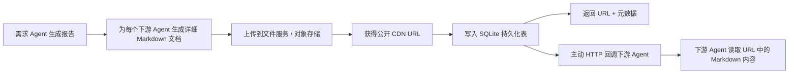

# 需求 Agent 下游任务文档 URL 化与持久化方案

## 1. 背景与目标

当前需求 Agent 已经可以完成需求解析、追问、报告生成和下游任务包生成。页面侧也已经支持查看完整报告、预览下游 Agent 的详细任务描述文档。

但在下游任务包的真实协作链路里，目前仍有几个明显缺口：

1. 详细任务描述文档只写到了本地 `outputs/handoff_docs/*.md`，无法被其他服务稳定访问。
2. 任务包返回的是本地文件路径和 Markdown 正文，不适合跨服务通信。
3. 下游 Agent 通信没有真正带上可读取的文档 URL。
4. handoff 任务包、文档上传结果、下游回调状态没有独立持久化记录。
5. 当前 SQLite 更多是保存需求任务和报告快照，缺少面向多 Agent 协作的交接表结构。

本方案目标是把 handoff 链路升级为：



## 2. 当前实现评估

### 2.1 已有能力

当前系统不是完全没有持久化。`demand_agent/storage.py` 已经实现了轻量 SQLite 和报告文件存储：

- SQLite 数据库：`outputs/demand_agent.sqlite3`
- 报告 JSON：`outputs/demand_reports/{report_id}.json`
- 报告 Markdown：`outputs/demand_reports/{report_id}.md`

SQLite 当前包含两张表：

- `demand_tasks`
- `demand_reports`

服务启动时会通过 `DemandStorage.load_all_tasks()` 把已有任务加载回内存，因此 API 重启后仍可以读取历史任务和报告。

### 2.2 当前 handoff 实现

当前 `DemandAnalysisService.handoff()` 的主要流程是：

1. 获取需求任务。
2. 如果没有报告，则生成报告。
3. 遍历 `target_agents`。
4. 调用 `_build_handoff_package()` 生成 Agent 专属任务包。
5. 调用 `_handoff_markdown()` 生成详细 Markdown 文档。
6. 调用 `DemandStorage.save_handoff_doc()` 写入本地 md 文件。
7. 在响应里返回 `detail_doc.markdown_path` 和 `detail_doc.markdown`。

这个实现对 demo 足够友好，但对真实下游 Agent 协作不够稳：

- `markdown_path` 是本机路径，下游服务无法直接读取。
- `markdown` 正文会让通信 payload 变大，也不利于后续版本追踪。
- handoff 文档没有单独表记录，无法查询上传状态、回调状态和失败原因。
- 没有对象存储上传能力。
- 没有下游 Agent endpoint 配置和主动回调能力。

## 3. 总体设计

### 3.1 设计原则

1. 保留现有任务和报告模型，不做大规模重构。
2. 新增 handoff 相关表，专门管理下游任务包、文档资产和回调记录。
3. Markdown 文档仍然由需求 Agent 生成，但正式通信只传 URL 和元数据。
4. 上传能力通过适配器抽象，避免把具体云厂商或内部文件服务写死在业务逻辑里。
5. 下游 Agent endpoint 先通过本地 SQLite 的 Agent 注册表读取，并提供管理页面进行可视化维护；需求 Agent 不在代码里硬编码下游地址。
6. 第一版使用公开 CDN URL，方便下游 Agent 无鉴权读取文档。
7. demo 页面保留在线预览能力，点击 handoff 文档时通过 URL 拉取 Markdown 并渲染。

### 3.2 目标链路

生成 handoff 时，每个目标 Agent 都会得到一个独立的详细任务文档：

```text
用户需求 -> 需求报告 -> Agent 专属 handoff package -> Agent 专属 Markdown 文档
```

文档生成后进入上传和分发流程：

```text
Markdown 文档
  -> 写入本地文件，便于排障
  -> HTTP 上传到文件服务 / 对象存储
  -> 获得公开 CDN URL
  -> 写入 handoff_documents
  -> 构造 task_package.detail_doc
  -> 主动回调对应下游 Agent endpoint
```

### 3.3 推荐边界

本次建议只做 handoff 链路增强，不建议同时把需求字段、追问、对话轮次等全部拆表。原因是：

- 当前 `payload_json` 快照对 MVP 阶段仍然够用。
- 大规模规范化会扩大改动面，影响已有测试和 API。
- handoff 是当前最明确的持久化缺口，优先补这块收益最大。

## 4. API 与数据结构设计

### 4.1 Handoff 请求保持兼容

现有接口保持不变：

```http
POST /v1/agents/demand-analysis/tasks/{demand_task_id}/handoff
Content-Type: application/json
```

请求体：

```json
{
  "target_agents": ["cultural_ip_agent", "designer_agent", "marketer_agent"]
}
```

### 4.2 Handoff 响应结构调整

响应继续返回 `task_packages`，但每个 package 的 `detail_doc` 改为 URL + 元数据，不再把 Markdown 正文作为正式字段返回。

推荐响应：

```json
{
  "demand_task_id": "demand_xxx",
  "handoff_id": "handoff_xxx",
  "status": "Handoff",
  "task_packages": [
    {
      "package_id": "pkg_xxx",
      "agent": "cultural_ip_agent",
      "agent_name": "文化IP设计师Agent",
      "task": "生成文化IP方向",
      "source_report_id": "dr_xxx",
      "source_report_version": "v1.0",
      "source_summary": {},
      "inputs": {},
      "constraints": {},
      "expected_outputs": [],
      "detailed_brief": {},
      "detail_doc": {
        "doc_id": "doc_xxx",
        "title": "文化IP设计师Agent详细任务描述",
        "format": "markdown",
        "url": "https://cdn.example.com/demand-agent/handoff/doc_xxx.md",
        "object_key": "demand-agent/handoff/doc_xxx.md",
        "checksum": "sha256:xxxx",
        "size_bytes": 12345,
        "version": "v1.0",
        "uploaded_at": "2026-06-28T12:00:00+00:00"
      },
      "callback": {
        "status": "success",
        "endpoint": "https://agent.example.com/cultural-ip/handoff",
        "http_status": 200,
        "error": null
      }
    }
  ]
}
```

### 4.3 下游 Agent 回调 Payload

需求 Agent 主动 HTTP 回调下游 Agent 时，建议使用如下 payload：

```json
{
  "event": "demand_handoff.created",
  "handoff_id": "handoff_xxx",
  "package_id": "pkg_xxx",
  "demand_task_id": "demand_xxx",
  "report_id": "dr_xxx",
  "agent": "cultural_ip_agent",
  "agent_name": "文化IP设计师Agent",
  "task": "生成文化IP方向",
  "detail_doc": {
    "doc_id": "doc_xxx",
    "title": "文化IP设计师Agent详细任务描述",
    "format": "markdown",
    "url": "https://cdn.example.com/demand-agent/handoff/doc_xxx.md",
    "checksum": "sha256:xxxx",
    "size_bytes": 12345,
    "version": "v1.0"
  },
  "source_summary": {},
  "expected_outputs": [],
  "created_at": "2026-06-28T12:00:00+00:00"
}
```

下游 Agent 的职责是：

1. 接收回调 payload。
2. 读取 `detail_doc.url`。
3. 校验可选的 `checksum`。
4. 基于 Markdown 文档执行后续任务。

## 5. 数据库设计

### 5.1 handoff_batches

用于记录一次 handoff 批次。一次 handoff 可能包含多个目标 Agent。

```sql
CREATE TABLE IF NOT EXISTS handoff_batches (
    handoff_id TEXT PRIMARY KEY,
    demand_task_id TEXT NOT NULL,
    report_id TEXT NOT NULL,
    target_agents_json TEXT NOT NULL,
    status TEXT NOT NULL,
    created_at TEXT NOT NULL,
    updated_at TEXT NOT NULL
);
```

字段说明：

| 字段 | 说明 |
| --- | --- |
| `handoff_id` | handoff 批次 ID |
| `demand_task_id` | 需求任务 ID |
| `report_id` | 来源报告 ID |
| `target_agents_json` | 本次目标 Agent 列表 |
| `status` | `generated`、`partial_failed`、`completed` |
| `created_at` | 创建时间 |
| `updated_at` | 更新时间 |

### 5.2 handoff_packages

用于记录每个下游 Agent 的任务包和回调状态。

```sql
CREATE TABLE IF NOT EXISTS handoff_packages (
    package_id TEXT PRIMARY KEY,
    handoff_id TEXT NOT NULL,
    demand_task_id TEXT NOT NULL,
    report_id TEXT NOT NULL,
    agent TEXT NOT NULL,
    agent_name TEXT NOT NULL,
    task_json TEXT NOT NULL,
    detail_doc_id TEXT,
    callback_status TEXT NOT NULL,
    callback_endpoint TEXT,
    callback_http_status INTEGER,
    callback_response_text TEXT,
    callback_error TEXT,
    callback_attempts INTEGER NOT NULL DEFAULT 0,
    created_at TEXT NOT NULL,
    updated_at TEXT NOT NULL
);
```

字段说明：

| 字段 | 说明 |
| --- | --- |
| `package_id` | 单个 Agent 任务包 ID |
| `handoff_id` | 所属批次 |
| `agent` | 下游 Agent 标识 |
| `agent_name` | 下游 Agent 展示名 |
| `task_json` | 不含 Markdown 正文的任务包 JSON |
| `detail_doc_id` | 对应文档 ID |
| `callback_status` | `pending`、`success`、`failed`、`skipped` |
| `callback_endpoint` | 实际回调地址 |
| `callback_http_status` | HTTP 状态码 |
| `callback_response_text` | 下游响应摘要，建议限制长度 |
| `callback_error` | 失败原因 |
| `callback_attempts` | 回调次数 |

### 5.3 handoff_documents

用于记录详细 Markdown 文档资产。

```sql
CREATE TABLE IF NOT EXISTS handoff_documents (
    doc_id TEXT PRIMARY KEY,
    package_id TEXT NOT NULL,
    demand_task_id TEXT NOT NULL,
    report_id TEXT NOT NULL,
    agent TEXT NOT NULL,
    title TEXT NOT NULL,
    format TEXT NOT NULL,
    local_markdown_path TEXT NOT NULL,
    public_url TEXT,
    object_key TEXT,
    checksum TEXT,
    size_bytes INTEGER,
    version TEXT NOT NULL,
    upload_status TEXT NOT NULL,
    upload_error TEXT,
    created_at TEXT NOT NULL,
    uploaded_at TEXT
);
```

字段说明：

| 字段 | 说明 |
| --- | --- |
| `doc_id` | 文档 ID |
| `package_id` | 所属任务包 ID |
| `local_markdown_path` | 本地 md 文件路径，用于排障 |
| `public_url` | 文件服务 / CDN 返回的公开 URL |
| `object_key` | 对象存储 key |
| `checksum` | 文档 SHA256 |
| `size_bytes` | 文档大小 |
| `upload_status` | `pending`、`uploaded`、`failed` |
| `upload_error` | 上传失败原因 |
| `uploaded_at` | 上传成功时间 |

### 5.4 索引建议

```sql
CREATE INDEX IF NOT EXISTS idx_handoff_batches_task
ON handoff_batches(demand_task_id);

CREATE INDEX IF NOT EXISTS idx_handoff_packages_handoff
ON handoff_packages(handoff_id);

CREATE INDEX IF NOT EXISTS idx_handoff_documents_package
ON handoff_documents(package_id);
```

### 5.5 agent_registry

用于替代第一版外部配置中心，持久化管理下游 Agent 的回调配置。它本质上是一张轻量的业务配置表，可由管理页面直接编辑。

```sql
CREATE TABLE IF NOT EXISTS agent_registry (
    agent TEXT PRIMARY KEY,
    agent_name TEXT NOT NULL,
    description TEXT,
    endpoint TEXT NOT NULL,
    enabled INTEGER NOT NULL DEFAULT 1,
    callback_enabled INTEGER NOT NULL DEFAULT 1,
    auth_type TEXT NOT NULL DEFAULT 'none',
    auth_header_name TEXT,
    auth_token TEXT,
    timeout_seconds INTEGER NOT NULL DEFAULT 30,
    environment TEXT NOT NULL DEFAULT 'default',
    metadata_json TEXT NOT NULL DEFAULT '{}',
    created_at TEXT NOT NULL,
    updated_at TEXT NOT NULL
);
```

字段说明：

| 字段 | 说明 |
| --- | --- |
| `agent` | 下游 Agent 标识，例如 `cultural_ip_agent` |
| `agent_name` | 展示名，例如 `文化IP设计师Agent` |
| `description` | 管理页面展示的说明 |
| `endpoint` | 下游 Agent handoff 回调地址 |
| `enabled` | Agent 是否启用 |
| `callback_enabled` | 是否允许主动回调该 Agent |
| `auth_type` | 鉴权类型，第一版支持 `none`、`bearer`、`custom_header` |
| `auth_header_name` | 自定义鉴权 header 名称；`bearer` 可默认为 `Authorization` |
| `auth_token` | 回调鉴权 token；如果安全要求提高，后续可迁移到密钥系统 |
| `timeout_seconds` | 回调超时时间 |
| `environment` | 环境标识，例如 `dev`、`test`、`prod` |
| `metadata_json` | 扩展配置，例如负责人、标签、限流策略 |
| `created_at` | 创建时间 |
| `updated_at` | 更新时间 |

索引建议：

```sql
CREATE INDEX IF NOT EXISTS idx_agent_registry_environment
ON agent_registry(environment);

CREATE INDEX IF NOT EXISTS idx_agent_registry_enabled
ON agent_registry(enabled, callback_enabled);
```

第一版建议在初始化数据库时写入三条默认记录，便于本地 demo 直接使用：

```json
[
  {
    "agent": "cultural_ip_agent",
    "agent_name": "文化IP设计师Agent",
    "endpoint": "http://127.0.0.1:9001/v1/agents/cultural-ip/handoff",
    "enabled": true,
    "callback_enabled": false
  },
  {
    "agent": "designer_agent",
    "agent_name": "设计师Agent",
    "endpoint": "http://127.0.0.1:9002/v1/agents/designer/handoff",
    "enabled": true,
    "callback_enabled": false
  },
  {
    "agent": "marketer_agent",
    "agent_name": "营销Agent",
    "endpoint": "http://127.0.0.1:9003/v1/agents/marketer/handoff",
    "enabled": true,
    "callback_enabled": false
  }
]
```

默认将 `callback_enabled` 设为 `false`，避免本地演示时误发请求；需要联调时再在管理页面打开。

## 6. 模块设计

### 6.1 DocumentUploader

新增上传抽象，避免业务代码关心具体上传方式。

推荐接口：

```python
@dataclass
class UploadedDocument:
    public_url: str
    object_key: str | None
    checksum: str
    size_bytes: int
    uploaded_at: str


class DocumentUploader:
    def upload_markdown(
        self,
        *,
        doc_id: str,
        filename: str,
        markdown: str,
        metadata: dict[str, str],
    ) -> UploadedDocument:
        raise NotImplementedError
```

第一版实现 `HttpDocumentUploader`：

- 使用 `urllib.request`，保持当前项目标准库风格。
- 从环境变量读取上传服务配置。
- 将 Markdown 作为 `multipart/form-data` 或 JSON body 上传，具体取决于文件服务协议。
- 解析上传服务返回值，拿到 `public_url` 和 `object_key`。

建议环境变量：

```bash
DEMAND_DOC_UPLOAD_ENABLED=true
DEMAND_DOC_UPLOAD_ENDPOINT=https://file-service.example.com/upload
DEMAND_DOC_UPLOAD_TOKEN=xxx
DEMAND_DOC_UPLOAD_TIMEOUT_SECONDS=30
DEMAND_DOC_PUBLIC_URL_FIELD=url
DEMAND_DOC_OBJECT_KEY_FIELD=object_key
```

### 6.2 AgentRegistryProvider

下游 Agent 地址不建议写死在代码里。第一版建议新增基于 SQLite 的 Agent 注册表读取层，从 `agent_registry` 表读取 endpoint、开关、鉴权和超时配置。

推荐接口：

```python
@dataclass
class AgentEndpoint:
    agent: str
    endpoint: str
    enabled: bool
    auth_headers: dict[str, str]
    timeout_seconds: int


class AgentRegistryProvider:
    def get_endpoint(self, agent: str) -> AgentEndpoint | None:
        raise NotImplementedError
```

第一版实现 `DatabaseAgentRegistryProvider`：

- 从 `agent_registry` 表读取指定 `agent` 的配置。
- 仅当 `enabled=1` 且 `callback_enabled=1` 时返回可回调 endpoint。
- 将 `auth_type`、`auth_header_name`、`auth_token` 转换为实际 HTTP headers。
- 将 `timeout_seconds` 传给回调分发器。
- 如果未找到 Agent，返回 `None`，并将回调状态记录为 `skipped` 或 `failed`。

推荐管理接口：

```http
GET /v1/agents/demand-analysis/agent-registry
POST /v1/agents/demand-analysis/agent-registry
PUT /v1/agents/demand-analysis/agent-registry/{agent}
PATCH /v1/agents/demand-analysis/agent-registry/{agent}/toggle
DELETE /v1/agents/demand-analysis/agent-registry/{agent}
```

推荐 API 返回结构：

```json
{
  "agents": [
    {
      "agent": "cultural_ip_agent",
      "agent_name": "文化IP设计师Agent",
      "description": "负责生成文化 IP 方向",
      "endpoint": "https://agent.example.com/cultural-ip/handoff",
      "enabled": true,
      "callback_enabled": true,
      "auth_type": "bearer",
      "auth_header_name": "Authorization",
      "timeout_seconds": 30,
      "environment": "dev",
      "metadata": {}
    },
    {
      "agent": "designer_agent",
      "agent_name": "设计师Agent",
      "description": "负责生成视觉和产品设计方案",
      "endpoint": "https://agent.example.com/designer/handoff",
      "enabled": true,
      "callback_enabled": true,
      "auth_type": "none",
      "auth_header_name": null,
      "timeout_seconds": 30,
      "environment": "dev",
      "metadata": {}
    }
  ]
}
```

鉴权处理：

1. `auth_type=none`：不附加鉴权 header。
2. `auth_type=bearer`：发送 `Authorization: Bearer {auth_token}`。
3. `auth_type=custom_header`：发送 `{auth_header_name}: {auth_token}`。

安全建议：

- 第一版为了降低实现成本，可以将 `auth_token` 存在 SQLite。
- 管理页面展示时应隐藏 token 明文，只允许重新填写覆盖。
- 如果后续安全要求提高，可将 token 迁移到密钥管理系统，`agent_registry` 仅保存 secret 引用。

### 6.3 Agent 注册表管理页面

为了降低配置成本，建议在 demo 或后续管理系统中增加一个“下游 Agent 配置”页面。

页面能力：

1. 查看所有下游 Agent。
2. 新增 Agent。
3. 编辑展示名、描述、endpoint、超时时间、环境、metadata。
4. 开关 `enabled` 和 `callback_enabled`。
5. 配置鉴权方式，但不回显 token 明文。
6. 提供“测试连接”按钮，向 endpoint 发送轻量探测请求或 dry-run handoff payload。
7. 显示最近一次回调状态、HTTP 状态码和错误摘要。

页面字段建议：

| 字段 | 控件 |
| --- | --- |
| Agent 标识 | 文本输入，创建后不建议修改 |
| 展示名 | 文本输入 |
| 描述 | 多行文本 |
| Endpoint | URL 输入 |
| 启用 Agent | 开关 |
| 启用主动回调 | 开关 |
| 鉴权类型 | 下拉选择 |
| Header 名称 | 文本输入 |
| Token | 密码输入，只写不读 |
| 超时时间 | 数字输入 |
| 环境 | 下拉选择或文本输入 |
| 扩展配置 | JSON 编辑框 |

### 6.4 HandoffDispatcher

新增下游回调分发器。

职责：

1. 根据 agent 从 `DatabaseAgentRegistryProvider` 获取 endpoint。
2. 构造回调 payload。
3. 发起 HTTP POST。
4. 返回回调结果。
5. 不负责生成文档，也不直接操作数据库。

推荐结果结构：

```python
@dataclass
class DispatchResult:
    status: str
    endpoint: str | None
    http_status: int | None
    response_text: str | None
    error: str | None
    attempts: int
```

## 7. Service 流程调整

### 7.1 新 handoff 流程

`DemandAnalysisService.handoff()` 调整为：

1. 加载任务。
2. 确保报告存在。
3. 创建 `handoff_id`。
4. 创建 `handoff_batches` 记录，初始状态为 `generated`。
5. 遍历目标 Agent。
6. 生成 handoff package。
7. 生成详细 Markdown。
8. 生成 `doc_id`、`package_id`。
9. 保存本地 Markdown。
10. 上传 Markdown。
11. 写入 `handoff_documents`。
12. 构造不含 Markdown 正文的 `detail_doc`。
13. 写入 `handoff_packages`。
14. 调用 `HandoffDispatcher`，从 `agent_registry` 读取 endpoint 后主动回调下游 Agent。
15. 更新 `handoff_packages.callback_*` 字段。
16. 汇总更新 `handoff_batches.status`。
17. 返回 task packages。

### 7.2 状态规则

推荐批次状态：

| 状态 | 说明 |
| --- | --- |
| `generated` | 文档已生成，流程启动 |
| `completed` | 所有文档上传成功，所有启用的下游回调成功 |
| `partial_failed` | 至少一个上传或回调失败 |

推荐文档上传状态：

| 状态 | 说明 |
| --- | --- |
| `pending` | 已生成本地文档，待上传 |
| `uploaded` | 上传成功并获得 URL |
| `failed` | 上传失败 |

推荐回调状态：

| 状态 | 说明 |
| --- | --- |
| `pending` | 待回调 |
| `success` | 回调成功 |
| `failed` | 回调失败 |
| `skipped` | Agent 未启用或无 endpoint |

### 7.3 失败处理

上传失败：

- 保留本地 Markdown 文件。
- `handoff_documents.upload_status = failed`。
- `handoff_documents.upload_error` 记录失败原因。
- 不调用下游回调。
- 当前 package 的 `callback_status` 记为 `skipped` 或 `failed`。
- API 返回中标记错误，便于页面展示。

回调失败：

- 文档和 URL 仍然保留。
- `handoff_packages.callback_status = failed`。
- 记录 HTTP 状态码、响应摘要或异常。
- 第一版不自动重试，避免复杂后台任务；后续可以增加手动重试接口。

Agent 注册表配置缺失或禁用：

- 文档仍然生成和上传。
- 如果 `agent_registry` 中不存在该 Agent，则回调状态记录为 `failed`，错误为 `agent registry not found`。
- 如果 `enabled=0` 或 `callback_enabled=0`，则回调状态记录为 `skipped`。
- 如果 endpoint 为空或格式非法，则回调状态记录为 `failed`，错误为 `invalid endpoint`。

## 8. 前端交互调整

### 8.1 Handoff 卡片

Handoff 输出区域建议展示：

- Agent 名称
- 任务名称
- 来源报告
- 输出物要求
- 文档 URL
- 上传状态
- 回调状态
- 预览按钮

如果上传或回调失败，展示明确状态：

- `文档上传失败`
- `下游通知失败`
- `未配置下游 Agent endpoint`
- `该 Agent 已禁用`
- `该 Agent 未开启主动回调`

### 8.2 Markdown 在线预览

当前页面已经有报告/文档预览弹窗，可以复用。

当前项目实际情况：

- `demand_agent/service.py` 的 `handoff()` 目前只返回 `detail_doc.markdown_path` 和 `detail_doc.markdown`。
- `demo/app.js` 的 Handoff 卡片只展示 `detail_doc.markdown_path`。
- 点击“预览详细文档”时，前端只读取 `detail_doc.markdown` 并调用 `openMarkdownDocument()`。
- 如果未来任务包只返回阿里云 OSS / CDN 的 `detail_doc.url`，当前按钮会直接失效，因为它不会主动 fetch URL。

因此，支持阿里云 OSS 在线 Markdown 预览需要把预览逻辑从“只读内联 Markdown”升级为“优先兼容内联 Markdown，没有正文时读取 URL”。

点击“预览详细文档”时：

1. 如果 `detail_doc.markdown` 存在，兼容旧数据，直接渲染。
2. 如果只有 `detail_doc.url`，则 fetch URL。
3. 获取 Markdown 文本后调用现有 `openMarkdownDocument()`。
4. 如果 fetch 失败，展示错误提示。

推荐前端逻辑：

```js
async function openHandoffDetailDocument(packageItem) {
  const detailDoc = packageItem.detail_doc || {};
  const title = detailDoc.title || `${packageItem.agent}详细任务描述`;

  if (detailDoc.markdown) {
    openMarkdownDocument(title, detailDoc.markdown);
    return;
  }

  if (detailDoc.url) {
    try {
      showNotice("正在加载在线 Markdown 文档...", "success");
      const response = await fetch(detailDoc.url);
      if (!response.ok) {
        throw new Error(`在线文档读取失败：${response.status}`);
      }
      const markdown = await response.text();
      openMarkdownDocument(title, markdown);
    } catch (error) {
      showNotice(error.message, "error");
    }
    return;
  }

  showNotice("当前任务包没有可预览的详细文档。", "warning");
}
```

Handoff 卡片展示文档地址时也需要兼容新旧字段：

```js
const docAddress = item.detail_doc?.url || item.detail_doc?.markdown_path || "--";
```

同时 `withoutMarkdownPayload()` 中的提示也应从 `[see detail_doc.markdown_path]` 调整为优先提示 `[see detail_doc.url]`。

注意：

- 公开 CDN URL 需要支持浏览器 GET。
- 如果 demo 页面和 OSS / CDN 跨域，需要阿里云 OSS Bucket 配置 CORS，允许当前页面域名执行 `GET`。
- 如果 OSS URL 使用私有读或签名 URL，要确保 URL 在预览时仍未过期。
- 如果 OSS 无法配置 CORS，或者不希望浏览器直接访问 OSS，则新增后端代理预览接口。

推荐后端代理接口：

```http
GET /v1/agents/demand-analysis/handoff-documents/{doc_id}/markdown
```

后端代理接口职责：

1. 根据 `doc_id` 查询 `handoff_documents.public_url` 或 `local_markdown_path`。
2. 优先读取本地 Markdown；如果没有本地文件，再由服务端请求 OSS URL。
3. 返回 `text/markdown; charset=utf-8`。
4. 如果文件不存在或 OSS 读取失败，返回明确错误。

在第一版公开 OSS URL 能配置 CORS 的情况下，可以不实现代理接口；但文档和代码应保留这个兜底设计，方便后续切换为私有 OSS 或签名 URL。

### 8.3 兼容旧响应

前端应兼容两类数据：

旧结构：

```json
{
  "detail_doc": {
    "markdown_path": "...",
    "markdown": "..."
  }
}
```

新结构：

```json
{
  "detail_doc": {
    "url": "https://cdn.example.com/doc.md",
    "checksum": "sha256:xxx",
    "size_bytes": 12345
  }
}
```

这样历史 demo 数据不会立刻失效。

## 9. 配置项汇总

### 9.1 文档上传

```bash
DEMAND_DOC_UPLOAD_ENABLED=true
DEMAND_DOC_UPLOAD_ENDPOINT=https://file-service.example.com/upload
DEMAND_DOC_UPLOAD_TOKEN=xxx
DEMAND_DOC_UPLOAD_TIMEOUT_SECONDS=30
DEMAND_DOC_PUBLIC_URL_FIELD=url
DEMAND_DOC_OBJECT_KEY_FIELD=object_key
```

### 9.2 下游回调

```bash
DEMAND_HANDOFF_CALLBACK_ENABLED=true
DEMAND_HANDOFF_CALLBACK_TIMEOUT_SECONDS=30
DEMAND_HANDOFF_CALLBACK_RESPONSE_LIMIT=1000
```

## 10. 测试计划

### 10.1 单元测试

需要新增或调整以下测试：

1. handoff 生成后每个 Agent 都有独立 `package_id`、`doc_id`。
2. 文档上传成功后返回 `detail_doc.url`、`checksum`、`size_bytes`。
3. 响应中不再依赖 `detail_doc.markdown`。
4. `handoff_batches`、`handoff_packages`、`handoff_documents` 三类记录正确写入 SQLite。
5. 上传失败时保留本地 Markdown，记录 `upload_status=failed` 和错误信息。
6. 上传失败时不调用下游 Agent。
7. `agent_registry` 中配置 endpoint 后，dispatcher 正确 POST 下游。
8. 下游回调失败时记录 `callback_status=failed`。
9. 服务重启后可以查询已有 handoff 记录。
10. Agent 被禁用或未开启主动回调时，回调状态记录为 `skipped`。
11. 管理接口可以新增、编辑、启停 Agent 配置。
12. 旧数据中仍然包含 `detail_doc.markdown` 时，前端预览逻辑不受影响。
13. 新数据只包含 `detail_doc.url` 时，前端会尝试读取在线 Markdown。
14. 如果实现后端代理接口，`doc_id` 可以正确返回 `text/markdown`。

### 10.2 API 测试

需要覆盖：

1. `POST /handoff` 返回 `handoff_id`。
2. 每个 `task_package.detail_doc.url` 可用。
3. 每个 `task_package.callback.status` 和数据库记录一致。
4. 对未知 Agent，任务包和文档仍可生成，但回调状态为失败。
5. 对已禁用 Agent，任务包和文档仍可生成，但回调状态为跳过。
6. 如果提供 `GET /handoff-documents/{doc_id}/markdown`，接口能读取本地文件或 OSS URL 并返回 Markdown。

### 10.3 前端验证

需要验证：

1. Handoff 卡片展示 URL、上传状态和回调状态。
2. 点击预览按钮可以在线拉取 Markdown 并渲染。
3. Markdown 拉取失败时给出友好提示。
4. 下游 Agent 配置页面可以完成新增、编辑、启停和测试连接。
5. 旧结构和新结构都可以预览。
6. OSS / CDN 跨域失败时，页面显示错误提示，不出现空弹窗。
7. 使用后端代理预览接口时，不要求浏览器直接跨域访问 OSS。

## 11. 分阶段落地建议

### 阶段一：持久化和本地兼容

目标：

- 新增 handoff 三张表。
- 生成 `handoff_id`、`package_id`、`doc_id`。
- 保存本地 md 文件。
- API 返回新结构，但可以先用本地模拟 URL。

价值：

- 先把 handoff 数据结构稳定下来。
- 不依赖外部文件服务。

### 阶段二：HTTP 上传适配器

目标：

- 接入 `HttpDocumentUploader`。
- 上传 md 文件并拿到公开 CDN URL。
- 记录上传状态和错误。

价值：

- 下游 Agent 可以通过 URL 读取 Markdown。
- 页面可以基于 URL 在线预览。

### 阶段三：Agent 注册表管理和主动回调

目标：

- 新增 `agent_registry` 表。
- 接入 `DatabaseAgentRegistryProvider`。
- 增加下游 Agent 配置管理接口和管理页面。
- 根据 `agent_registry` 获取下游 Agent endpoint。
- 主动 POST handoff payload。
- 记录回调状态。

价值：

- 需求 Agent 从“生成任务包”升级为“分发任务包”。
- endpoint 和开关可以可视化维护，不需要改代码。
- 多 Agent 协作链路真正闭环。

### 阶段四：重试和运维能力

目标：

- 增加手动重试回调接口。
- 增加 handoff 查询接口。
- 增加页面上的状态刷新能力。

可选接口：

```http
GET /v1/agents/demand-analysis/tasks/{demand_task_id}/handoffs
POST /v1/agents/demand-analysis/handoffs/{handoff_id}/retry
```

## 12. 风险与取舍

### 12.1 公开 CDN URL 风险

本方案选择公开 CDN URL，优点是下游 Agent 读取简单，不需要鉴权。但缺点是需求文档可能包含客户、预算、商业策略等敏感信息。

如果后续安全要求提高，建议升级为：

1. 签名 URL。
2. 服务端代理 URL。
3. 下游 Agent 内网鉴权读取。

### 12.2 主动回调复杂度

主动回调会让需求 Agent 承担编排职责。它不再只是生成报告和任务包，还要负责通知下游、记录状态、处理失败。

如果下游 Agent endpoint 还不稳定，可以先只实现 URL 返回和落库，回调能力通过配置开关控制。

### 12.3 Agent 注册表配置风险

使用 SQLite 表管理 Agent 配置实现成本低，但需要注意：

1. endpoint 配置错误会导致回调失败。
2. `auth_token` 存在数据库中有泄露风险，管理页面不应回显明文。
3. 多环境共用一张表时，要明确 `environment` 过滤策略，避免 dev 请求误发到 prod。
4. 后续如果多个服务都要共享 Agent 注册表，可以再抽成独立配置中心或管理服务。

### 12.4 不建议立即全量拆表

当前需求字段、追问和对话轮次仍可以保存在 `payload_json` 中。除非出现强查询、统计、审计需求，否则不建议现在拆成多张业务表。

### 12.5 OSS 在线预览风险

阿里云 OSS 在线 Markdown 预览需要额外注意：

1. 如果前端直接 fetch OSS URL，Bucket 必须配置 CORS，允许 demo 页面所在域名执行 `GET`。
2. 如果 URL 是签名 URL，预览时可能因为过期失败。
3. 如果文档包含敏感信息，公开 OSS / CDN URL 会扩大访问面。
4. 如果不希望浏览器直接访问 OSS，应该使用需求 Agent 后端代理接口读取并返回 Markdown。

## 13. 最终推荐方案

第一版实施建议：

1. 保留现有 `demand_tasks` 和 `demand_reports`。
2. 新增 `handoff_batches`、`handoff_packages`、`handoff_documents`、`agent_registry`。
3. 增加 `DocumentUploader`，第一版实现 HTTP 上传适配器。
4. 增加 `DatabaseAgentRegistryProvider`，第一版从 SQLite 的 `agent_registry` 表读取下游 Agent 配置。
5. 增加 `HandoffDispatcher`，负责主动 HTTP 回调下游 Agent。
6. 增加下游 Agent 配置管理接口和可视化页面。
7. `handoff` 响应改为 URL + 元数据。
8. Demo 页面通过 `detail_doc.url` 在线预览 Markdown，并兼容旧的 `detail_doc.markdown`。
9. 如果 OSS CORS 或权限模型不允许前端直连，则补充后端 Markdown 代理预览接口。

这条路径改动集中、兼容当前系统，并且能自然演进到生产级多 Agent 编排。
