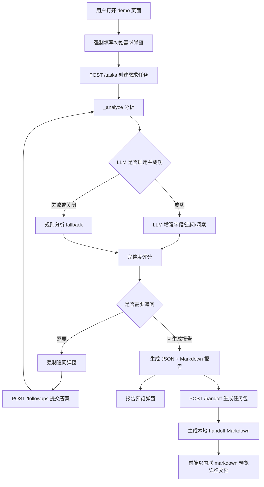

# 需求 Agent 当前实现分析文档

## 1. 文档目的

本文档用于说明 `multi_agent` 项目中需求分析师 Agent 的当前真实实现情况，重点回答：

1. 当前已经实现了哪些能力。
2. 这些能力分别由哪些代码模块支撑。
3. 当前实现还没有覆盖哪些能力。
4. 后续可以沿哪些方向继续演进。

本文档严格基于当前仓库代码，不把未来方案写成已完成能力。与下游任务文档 URL 化、OSS 上传、Agent 注册表、下游回调和前端实时刷新相关的详细规划，见：

- `需求Agent下游任务文档URL化与持久化方案.md`

当前主要代码文件：

- `demand_agent/service.py`
- `demand_agent/rules.py`
- `demand_agent/models.py`
- `demand_agent/storage.py`
- `demand_agent/api.py`
- `demand_agent/llm_client.py`
- `demand_agent/llm_analyzer.py`
- `demo/index.html`
- `demo/app.js`
- `demo/styles.css`
- `tests/test_demand_agent.py`

## 2. 总体结论

当前需求 Agent 已经是一个可运行的 MVP。它可以接收用户自然语言需求，进行规则分析或 LLM 增强分析，抽取需求字段，生成追问，接收追问答案和自由补充，刷新需求报告，并生成面向文化 IP、设计、营销等下游 Agent 的任务包。

当前系统由两层能力组成：

1. **规则分析能力**：依赖关键词、正则、内置推断、固定评分和模板报告，稳定可测，是系统的默认兜底路径。
2. **LLM 增强入口**：通过 DeepSeek 风格的 Chat Completions 接口获取结构化 JSON，支持失败回退到规则分析，并支持对缺失字段或非法 JSON 的修复尝试。

前端 demo 已经支持较完整的演示交互：

- 初始需求、品牌上下文、目标渠道通过强制弹窗填写。
- 存在追问时通过强制弹窗回答。
- 左侧保留自由补充需求输入。
- 报告可以通过弹窗进行富文本预览。
- 下游任务包可以展示详细文档并通过弹窗预览。
- 初始分析、追问提交、自由补充和生成 handoff 时都有基础 loading 反馈。

需要特别说明的是，当前 handoff 详细文档仍然只是在本地生成 Markdown 文件，并通过接口响应里的 `detail_doc.markdown` 内联给前端预览。当前尚未实现：

- OSS / CDN 上传。
- `detail_doc.url` 在线 Markdown 预览。
- `agent_registry` 配置表。
- `handoff_results` 下游结果表。
- 下游 Agent 完成任务后的回调接口。
- 前端轮询、SSE 或 WebSocket 实时刷新。
- 下游 Agent 配置管理页面。

## 3. 当前实现的核心功能

### 3.1 创建需求分析任务

实现位置：`demand_agent/service.py` 的 `DemandAnalysisService.create_task`

创建任务时系统会：

1. 生成 `demand_task_id`，格式类似 `demand_xxxxxxxxxxxx`。
2. 保存用户原始输入 `user_input`。
3. 保存上下文 `context`，例如 `project_id`、`brand`、`target_channel`。
4. 记录任务历史事件 `created`。
5. 调用 `_analyze()` 进入分析流程。
6. 将任务持久化到 SQLite。

对应 API：

```text
POST /v1/agents/demand-analysis/tasks
```

示例请求：

```json
{
  "user_input": "为 3 月西湖春游的新婚人群设计一套丝绸伴手礼。",
  "context": {
    "brand": "南浔丝绸文化产业园",
    "target_channel": ["小红书", "线下文旅店"]
  }
}
```

### 3.2 规则分析

实现位置：

- `demand_agent/rules.py`
- `demand_agent/service.py`

规则分析包括：

1. `parse_intent()`：通过关键词判断意图。
2. `extract_fields()`：通过关键词、正则和上下文抽取字段。
3. `apply_inferences()`：根据已知字段补充推断字段。
4. `completeness_score()`：按字段权重计算完整度。
5. `build_questions()`：针对缺失字段生成追问。

当前可抽取字段包括：

| 字段 | 含义 |
| --- | --- |
| `target_users` | 目标人群 |
| `usage_scenarios` | 使用场景 |
| `product_categories` | 产品品类 |
| `materials` | 材质 |
| `location` | 地点 |
| `aesthetic_preferences` | 审美偏好 |
| `emotional_keywords` | 情绪关键词 |
| `cultural_preferences` | 文化偏好 |
| `channel_suggestions` | 渠道建议 |
| `time` | 时间 |
| `budget_range` | 预算区间 |
| `brand_context` | 品牌上下文 |

字段会包装成 `DemandField`，包含：

- `field_name`
- `field_value`
- `source`
- `confidence`
- `version`

当前字段来源枚举包括：

- `explicit`
- `context`
- `inferred`
- `assumption`
- `user_confirmed`

### 3.3 LLM 增强分析

实现位置：

- `demand_agent/llm_client.py`
- `demand_agent/llm_analyzer.py`
- `demand_agent/service.py`

当前 LLM 能力是可选增强，不是唯一分析路径。默认情况下 LLM 关闭，系统走规则 fallback。启用 LLM 后，系统会尝试调用 DeepSeek 风格接口，并要求模型返回结构化 JSON。

相关环境变量：

```bash
DEMAND_LLM_ENABLED=true
DEEPSEEK_API_KEY=你的APIKey
DEMAND_LLM_BASE_URL=https://api.deepseek.com
DEMAND_LLM_MODEL=deepseek-v4-flash
DEMAND_LLM_TIMEOUT_SECONDS=30
```

`.env` 会由 `load_dotenv()` 读取；如果同名系统环境变量已经存在，系统环境变量优先。

LLM 分析结果会写入任务和报告：

- `analysis_mode`
- `llm_status`
- `llm_model`
- `llm_error`
- `llm_repair_status`
- `llm_repair_attempts`
- `llm_validation_issues`
- `report_insights`
- `extra_fields`

当前支持的 LLM 行为包括：

1. LLM 成功时，使用 `llm_enhanced` 结果增强字段、追问和报告洞察。
2. LLM 关闭、失败、超时或返回非法内容时，回退到规则分析。
3. LLM 返回非法 JSON 或缺字段时，`LLMAnalyzer` 可以尝试修复。
4. 修复成功时记录 `success_repaired` 和 `llm_repair_status=success`。
5. 修复失败时保留失败状态并走规则 fallback。

### 3.4 完整度评分与状态流转

实现位置：`demand_agent/rules.py` 的 `completeness_score` 和 `demand_agent/service.py` 的 `_score_and_finish`

当前完整度总分为 100 分，主要字段权重如下：

| 字段 | 分值 |
| --- | ---: |
| `target_users` | 20 |
| `usage_scenarios` | 20 |
| `product_categories` | 15 |
| `budget_range` | 15 |
| `aesthetic_preferences` | 12 |
| `cultural_preferences` | 8 |
| `channel_suggestions` | 10 |

状态流转逻辑：

- 低于 60 且存在追问：`NeedClarification`
- 60 到 80 且存在假设：`AssumptionMode`
- 60 到 80 且无假设：根据追问情况决定继续澄清或生成报告
- 大于等于 80：`ReportReady`

如果任务达到可报告状态，会调用 `_generate_report()` 生成报告。

### 3.5 追问与自由补充

实现位置：

- `demand_agent/rules.py` 的 `build_questions`、`apply_answer`
- `demand_agent/service.py` 的 `get_questions`、`submit_answers`、`add_followup`
- `demand_agent/api.py`

当前有两类补充路径：

1. 追问答案：用户回答系统提出的结构化问题。
2. 自由补充：用户输入任意补充说明。

已实现 API：

```text
GET /v1/agents/demand-analysis/tasks/{demand_task_id}/questions
POST /v1/agents/demand-analysis/tasks/{demand_task_id}/answers
POST /v1/agents/demand-analysis/tasks/{demand_task_id}/followups
```

`answers` 接口内部复用 `add_followup()`。`followups` 可以同时携带：

```json
{
  "message": "预算控制在300元以内，整体风格偏年轻国潮。",
  "answers": {
    "budget_range": "300元以内"
  }
}
```

每次补充会记录到 `conversation_turns`，包含：

- `turn_index`
- `message`
- `answers`
- `submitted_questions`
- `changed_fields`
- `analysis_mode`
- `llm_status`
- `llm_repair_status`
- `llm_repair_attempts`
- `timestamp`

这些轮次会随任务 payload 持久化到 SQLite。

### 3.6 报告生成

实现位置：`demand_agent/service.py` 的 `_generate_report`、`_structured_report`、`_markdown_report`

当前系统会同时生成：

1. 结构化 JSON 报告。
2. Markdown 报告。

报告结构包含：

- `report_id`
- `demand_task_id`
- `version`
- `analysis_mode`
- `llm_status`
- `llm_model`
- `llm_error`
- `llm_repair_status`
- `llm_repair_attempts`
- `project_summary`
- `original_requirement`
- `intent`
- `confirmed_fields`
- `assumptions`
- `fields`
- `personas`
- `scenario_map`
- `product_recommendations`
- `constraints`
- `trend_summary`
- `risk_notes`
- `pending_questions`
- `conversation_turns`
- `latest_followup`
- `report_files`

报告文件会写入：

```text
outputs/demand_reports/{report_id}.json
outputs/demand_reports/{report_id}.md
```

### 3.7 下游 Agent 任务包与详细文档

实现位置：

- `demand_agent/service.py` 的 `handoff`
- `demand_agent/service.py` 的 `_build_handoff_package`
- `demand_agent/service.py` 的 `_handoff_markdown`
- `demand_agent/storage.py` 的 `save_handoff_doc`

当前已实现的目标 Agent：

| 目标 Agent | 任务内容 |
| --- | --- |
| `cultural_ip_agent` | 生成文化 IP 方向 |
| `designer_agent` | 生成文化产品视觉方案 |
| `marketer_agent` | 生成营销素材方向 |
| 其他名称 | 通用需求交接 |

对应 API：

```text
POST /v1/agents/demand-analysis/tasks/{demand_task_id}/handoff
```

每个任务包包含：

- `agent`
- `agent_name`
- `task`
- `source_report_id`
- `source_report_version`
- `source_summary`
- `inputs`
- `constraints`
- `expected_outputs`
- `detailed_brief`
- `detail_doc`

`detailed_brief` 当前包含：

- `objective`
- `work_scope`
- `research_dimensions`
- `acceptance_criteria`

`detail_doc` 当前结构为：

```json
{
  "title": "文化IP设计师Agent详细任务描述",
  "format": "markdown",
  "markdown_path": "outputs/handoff_docs/dr_xxx_cultural_ip_agent.md",
  "markdown": "# 文化IP设计师Agent详细任务描述\n..."
}
```

注意：当前 `detail_doc` 没有 `url` 字段，不会上传 OSS/CDN，也没有独立落库。前端预览按钮读取的是接口响应里的 `detail_doc.markdown`，不是在线文档 URL。

### 3.8 持久化存储

实现位置：`demand_agent/storage.py`

当前系统支持：

1. SQLite 数据库：`outputs/demand_agent.sqlite3`
2. 报告文件：
   - `outputs/demand_reports/{report_id}.json`
   - `outputs/demand_reports/{report_id}.md`
3. handoff 本地 Markdown 文件：
   - `outputs/handoff_docs/{report_id}_{agent}.md`

当前 SQLite 只有两张表：

- `demand_tasks`
- `demand_reports`

`demand_tasks` 使用 `payload_json` 保存完整任务快照。`demand_reports` 保存报告 Markdown、结构化 JSON 和文件路径。

当前尚未实现以下表：

- `handoff_batches`
- `handoff_packages`
- `handoff_documents`
- `agent_registry`
- `handoff_results`

服务初始化时会加载已有任务：

```python
self.tasks: dict[str, DemandTask] = self.storage.load_all_tasks()
```

因此 API 服务重启后仍可读取已持久化任务和报告。

### 3.9 HTTP API 服务

实现位置：`demand_agent/api.py`

当前 API 使用 Python 标准库 `http.server` 和 `ThreadingHTTPServer` 实现，没有引入 FastAPI、Flask、Starlette 等框架。

已实现接口：

| 方法 | 路径 | 功能 |
| --- | --- | --- |
| `POST` | `/v1/agents/demand-analysis/tasks` | 创建需求任务 |
| `GET` | `/v1/agents/demand-analysis/tasks/{id}/questions` | 获取追问 |
| `POST` | `/v1/agents/demand-analysis/tasks/{id}/answers` | 提交追问答案 |
| `POST` | `/v1/agents/demand-analysis/tasks/{id}/followups` | 提交自由补充或追问答案 |
| `GET` | `/v1/agents/demand-analysis/tasks/{id}/report` | 获取报告 |
| `POST` | `/v1/agents/demand-analysis/tasks/{id}/handoff` | 生成下游任务包 |
| `GET` | `/demo` 和 `/demo/*` | 服务静态 demo 页面 |

当前未实现接口：

- Handoff 列表查询。
- Handoff 状态查询。
- Handoff 重试。
- 下游 Agent 完成任务后的 callback 接口。
- Handoff 文档代理预览接口。
- Agent 注册表管理接口。

### 3.10 Demo 前端

实现位置：

- `demo/index.html`
- `demo/app.js`
- `demo/styles.css`

当前 demo 是静态页面，由 `demand_agent/api.py` 的 `_static()` 方法提供。

已实现交互：

1. 初始需求输入通过强制弹窗完成。
2. 初始弹窗要求填写原始需求、品牌上下文和目标渠道。
3. 有追问时通过强制追问弹窗回答。
4. 左侧保留自由补充需求输入。
5. 可查看当前需求、品牌上下文和目标渠道。
6. 可查看任务状态、字段抽取结果、补充记录。
7. 报告预览为摘要卡片，完整报告通过弹窗展示。
8. Handoff 输出以卡片展示。
9. Handoff 详细任务描述通过弹窗预览。
10. 分析、追问提交、自由补充、生成 handoff 时有 loading 文案和按钮状态。

当前前端限制：

- Handoff 文档地址展示的是 `detail_doc.markdown_path`。
- “预览详细文档”按钮只读取 `detail_doc.markdown`。
- 不会 fetch `detail_doc.url`。
- 不支持 OSS / CDN Markdown 在线预览。
- 没有 handoff 状态轮询。
- 没有 SSE 或 WebSocket。
- 没有下游 Agent 配置管理页面。

### 3.11 自动化测试

实现位置：`tests/test_demand_agent.py`

当前测试覆盖：

- 一句话需求抽取核心字段。
- 缺失字段生成最多 3 个追问。
- 用户回答后字段变为 `user_confirmed` 并提高评分。
- 跳过预算时进入假设逻辑。
- 报告 Markdown 和 JSON 结构稳定。
- Handoff 包按 Agent 类型区分输入字段。
- Handoff 详细 Markdown 文档写入本地文件。
- 报告持久化到 SQLite 和输出文件，并可重新加载。
- LLM 成功增强字段、追问和报告洞察。
- LLM 失败时回退规则分析。
- LLM disabled 时不需要 API key。
- LLM 输出清洗和追问字段过滤。
- LLM JSON 修复成功、修复失败和修复关闭。
- 自由补充更新字段并刷新报告。
- 多轮补充可持久化并重载。
- 空 followup 被拒绝。
- demo 静态页面和资源可访问。
- CORS header 返回。
- API 层 followup 错误路径。

当前测试未覆盖：

- OSS 上传。
- `detail_doc.url` 在线预览。
- `agent_registry`。
- `handoff_results`。
- 下游完成回调。
- 前端轮询/SSE/WebSocket。

## 4. 当前实现流程



## 5. 当前未实现能力

以下能力目前只存在于后续方案或产品设想中，代码尚未实现：

1. OSS / CDN 上传 handoff Markdown。
2. `detail_doc.url` 字段。
3. 前端 fetch 在线 Markdown URL。
4. Handoff 文档代理预览接口。
5. `handoff_batches`、`handoff_packages`、`handoff_documents` 表。
6. `agent_registry` 表和可视化管理页面。
7. `handoff_results` 表。
8. 主动通知下游 Agent 后的执行结果回调接口。
9. Handoff 状态查询接口。
10. 前端轮询刷新 handoff 状态。
11. SSE 或 WebSocket。
12. 认证鉴权、权限管理、操作审计。

这些能力的详细设计已沉淀在 `需求Agent下游任务文档URL化与持久化方案.md`。

## 6. 当前实现的不足

### 6.1 规则分析仍依赖关键词

规则路径稳定，但泛化能力有限。对于同义表达、隐含语义、复杂约束和行业上下文，规则识别仍可能漏掉或误判。

改进建议：

1. 扩展同义词和归一化规则。
2. 继续使用 LLM 增强作为语义解析层。
3. 为字段增加原文证据和抽取依据。

### 6.2 LLM 增强仍缺少生产级治理

当前 LLM 调用已支持失败回退和修复，但还缺少更完整的生产治理能力。

改进建议：

1. 增加调用日志和请求 ID。
2. 增加 token、耗时、失败率统计。
3. 增加提示词版本管理。
4. 增加敏感信息脱敏和审计。

### 6.3 追问策略仍偏固定

当前追问主要由缺失字段和固定题库决定，虽然 LLM 增强可以返回问题，但规则 fallback 下的追问优先级仍较固定。

改进建议：

1. 根据任务意图动态调整追问优先级。
2. 根据目标下游 Agent 的输入要求决定追问重点。
3. 增加生产数量、交付时间、禁忌偏好等高价值问题。

### 6.4 报告仍有模板化特征

报告结构完整，但规则 fallback 下的画像、场景、产品建议和趋势摘要仍以模板为主。

改进建议：

1. 接入文化知识库或历史方案库。
2. 报告中加入来源引用和字段证据。
3. 趋势摘要接入真实外部数据源。

### 6.5 Handoff 还停留在本地文件和内联 Markdown 阶段

当前可以生成详细任务文档，但没有上传、URL、独立持久化和跨服务可读能力。

改进建议：

1. 增加 handoff 三类持久化表。
2. 接入 OSS / CDN 或文件上传服务。
3. 返回 `detail_doc.url` 和元数据。
4. 前端支持在线 Markdown 预览。

### 6.6 下游 Agent 协作链路尚未闭环

当前需求 Agent 只生成任务包，不会真正编排下游执行，也不会接收下游完成结果。

改进建议：

1. 增加 `agent_registry` 表和配置管理页面。
2. 增加下游 callback 接口。
3. 增加 `handoff_results` 表。
4. 前端先用轮询刷新状态，后续再考虑 SSE 或 WebSocket。

### 6.7 API 工程化程度仍偏 MVP

当前 API 基于标准库实现，足够轻量，但缺少生产常用能力：

- OpenAPI 文档。
- 请求/响应 schema。
- 鉴权。
- 统一错误码。
- 分页和列表查询。
- 任务删除和归档。
- 更完整的并发写入保护。

改进建议：

1. 后续迁移到 FastAPI。
2. 使用 Pydantic 定义模型。
3. 增加 `/health`、任务列表、handoff 查询等接口。
4. 增加统一日志和错误结构。

## 7. 优先改进建议

### P0：保持当前 MVP 稳定

1. 保持规则 fallback 可用。
2. 扩充边界测试和 API 错误测试。
3. 完善 LLM 调用日志和失败可观测性。
4. 继续优化前端强制交互和 loading 体验。

### P1：补齐 handoff 工程闭环

1. 将 handoff 包和文档独立落库。
2. 增加 `detail_doc.url`。
3. 接入 OSS / CDN 上传。
4. 增加在线 Markdown 预览。
5. 增加 Agent 注册表。

### P2：补齐下游协作闭环

1. 增加主动回调下游 Agent。
2. 增加下游完成回调接口。
3. 增加 `handoff_results`。
4. 前端使用轮询更新下游任务状态。
5. 后续根据复杂度评估 SSE 或 WebSocket。

### P3：提升智能分析质量

1. 强化 LLM 提示词和输出校验。
2. 接入知识库和历史方案检索。
3. 引入趋势数据源。
4. 将字段质量纳入完整度评分。

## 8. 总结

当前需求 Agent 已经具备“需求入口 Agent”的基本形态：可以创建任务、分析需求、追问澄清、自由补充、生成报告、持久化任务和报告，并输出面向下游 Agent 的任务包和详细 Markdown 文档。

它的优势是结构清晰、实现轻量、规则 fallback 稳定、LLM 增强可选、前端演示链路完整，并且测试覆盖了核心主流程。

它的主要短板集中在跨服务协作和生产化能力：handoff 文档还没有 URL 化，任务包和下游结果还没有独立落库，下游 Agent 执行结果还不能回写，前端也还没有状态轮询或实时刷新。

后续如果要从演示型 MVP 走向多 Agent 协作系统，建议优先参考 `需求Agent下游任务文档URL化与持久化方案.md`，按“handoff 持久化 -> 文档 URL 化 -> Agent 注册表 -> 下游回调 -> 前端轮询刷新”的顺序推进。
