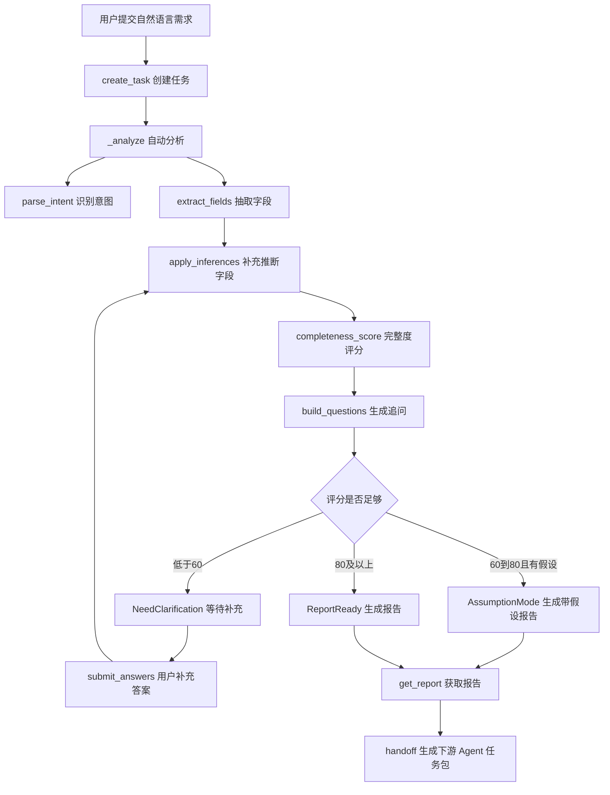

# 需求 Agent 当前实现分析文档

## 1. 文档目的

本文档用于说明 `multi_agent` 项目中当前需求分析师 Agent 的实际实现情况，重点回答三个问题：

1. 当前已经实现了哪些功能。
2. 这些功能是如何通过代码实现的。
3. 当前实现还存在哪些不足，以及后续可以如何改进。

本文档基于当前代码目录：

- `demand_agent/service.py`
- `demand_agent/rules.py`
- `demand_agent/models.py`
- `demand_agent/storage.py`
- `demand_agent/api.py`
- `tests/test_demand_agent.py`
- `outputs/demand_reports/dr_fbb66a5a8de7.json`

## 2. 总体结论

当前需求 Agent 已经实现了一个可运行的 MVP。它可以接收用户的一句话自然语言需求，抽取关键需求字段，判断需求完整度，生成追问问题，接收用户补充回答，生成结构化需求报告和 Markdown 报告，并为文化 IP、设计、营销等下游 Agent 生成任务交接包。

需要注意的是，当前实现本质上是一个确定性规则系统，而不是接入大模型或知识库的智能体。它主要依赖关键词匹配、正则抽取、固定评分规则和内置模板完成分析。因此它稳定、可测试、容易演示，但泛化能力、语义理解深度、趋势数据真实性和复杂多轮对话能力还比较有限。

## 3. 当前实现的核心功能

### 3.1 创建需求分析任务

实现位置：`demand_agent/service.py` 的 `DemandAnalysisService.create_task`

当前可以通过服务层或 API 创建需求任务。创建任务时系统会：

1. 生成 `demand_task_id`，格式类似 `demand_fbb66a5a8de7`。
2. 保存用户原始输入 `user_input`。
3. 保存可选上下文 `context`，例如 `project_id`、`brand`、`target_channel`。
4. 记录任务历史事件 `created`。
5. 立即进入自动分析流程 `_analyze`。
6. 将任务持久化到 SQLite 和输出目录。

对应 API：

```text
POST /v1/agents/demand-analysis/tasks
```

示例输入：

```json
{
  "user_input": "为 3 月西湖春游的新婚人群设计一套丝绸伴手礼。",
  "context": {
    "brand": "南浔丝绸文化产业园",
    "target_channel": ["小红书", "线下文旅店"]
  }
}
```

### 3.2 意图识别

实现位置：`demand_agent/rules.py` 的 `parse_intent`

当前意图识别通过关键词规则完成。系统内置了以下意图类型：

- 趋势调研
- 旧方案优化
- 人群洞察
- 品类选择
- 商业落地
- 新品设计
- 礼品定制
- 婚庆礼品

例如，用户输入中包含“人群”会命中“人群洞察”，包含“设计”“做一套”等会命中“新品设计”，包含“伴手礼”或“礼品”会补充“礼品定制”，包含“婚”会补充“婚庆礼品”。

当前输出结构类似：

```json
{
  "primary": "人群洞察",
  "secondary": ["人群洞察", "新品设计", "礼品定制", "婚庆礼品"],
  "confidence": 0.9
}
```

### 3.3 需求字段抽取

实现位置：`demand_agent/rules.py` 的 `extract_fields`

当前系统可以抽取以下需求字段：

| 字段 | 含义 | 示例 |
| --- | --- | --- |
| `target_users` | 目标人群 | 新婚人群、年轻女性、游客、商务客户 |
| `usage_scenarios` | 使用场景 | 春游纪念、婚礼回礼、景区零售 |
| `product_categories` | 产品品类 | 丝巾、香囊、礼盒、团扇 |
| `materials` | 材质 | 丝绸、真丝、宋锦、棉麻 |
| `location` | 地点 | 西湖、南浔、湖州、杭州、江南 |
| `aesthetic_preferences` | 审美偏好 | 江南清雅、新中式、年轻国潮 |
| `emotional_keywords` | 情绪关键词 | 浪漫、吉祥、仪式感 |
| `cultural_preferences` | 文化偏好 | 西湖、辑里湖丝、宋韵、并蒂莲 |
| `channel_suggestions` | 渠道建议 | 小红书、抖音、淘宝、线下文旅店 |
| `time` | 时间 | 3月、春季、七夕、中秋 |
| `budget_range` | 预算区间 | 300-500元、500元以上 |
| `brand_context` | 品牌上下文 | 南浔丝绸文化产业园 |

字段抽取主要由三类逻辑完成：

1. `KEYWORDS` 关键词表：通过判断关键词是否出现在用户输入中，映射到标准字段值。
2. 正则表达式：用于抽取时间和预算。
3. 上下文补充：从 `context.target_channel` 和 `context.brand` 中补充渠道和品牌信息。

每个字段都会被包装成 `DemandField`，包含：

- `field_name`
- `field_value`
- `source`
- `confidence`
- `version`

其中 `source` 用来区分字段来源：

- `explicit`：用户明确表达或上下文明确提供。
- `inferred`：系统根据规则推断。
- `assumption`：用户跳过或信息不足时的系统假设。
- `user_confirmed`：用户补充回答后确认。

### 3.4 规则推断

实现位置：`demand_agent/rules.py` 的 `apply_inferences`

当前系统支持少量推断规则。例如：

1. 如果目标用户包含“新婚人群”，且缺少使用场景，则推断为“婚礼回礼”和“旅拍纪念”。
2. 如果目标用户包含“新婚人群”，且缺少情绪关键词，则推断为“浪漫”“吉祥”“仪式感”。
3. 如果地点包含“西湖”“南浔”“江南”“杭州”“湖州”，且缺少审美偏好，则推断为“江南清雅”。
4. 如果有材质但缺少文化偏好，则将材质作为文化偏好补充。

这部分让系统可以从较短的输入中补齐一部分设计语义。以当前输出文件 `dr_fbb66a5a8de7.json` 为例，用户输入只有：

```text
为 3 月西湖春游的新婚人群设计一套丝绸伴手礼。
```

系统除抽取显性字段外，还推断出了：

- `emotional_keywords`: 浪漫、吉祥、仪式感
- `aesthetic_preferences`: 江南清雅

### 3.5 完整度评分

实现位置：`demand_agent/rules.py` 的 `completeness_score`

当前需求完整度评分总分为 100 分，按字段加权计算：

| 字段 | 分值 |
| --- | ---: |
| 目标人群 `target_users` | 20 |
| 使用场景 `usage_scenarios` | 20 |
| 产品品类 `product_categories` | 15 |
| 预算区间 `budget_range` | 15 |
| 审美偏好 `aesthetic_preferences` | 12 |
| 文化偏好 `cultural_preferences` | 8 |
| 渠道建议 `channel_suggestions` | 10 |

其中审美偏好和文化偏好合计最高 20 分。系统假设字段 `assumption` 会按 0.75 倍折算，避免把假设信息当作完全确认的信息。

评分结果会影响任务状态：

- 分数低于 60 且存在追问：进入 `NeedClarification`。
- 分数 60 到 80 且存在假设：进入 `AssumptionMode` 并生成报告。
- 分数 60 到 80 且无假设：根据是否仍有问题决定继续澄清或报告就绪。
- 分数大于等于 80：进入 `ReportReady` 并生成报告。

### 3.6 追问生成与答案提交

实现位置：

- `demand_agent/rules.py` 的 `build_questions`
- `demand_agent/rules.py` 的 `apply_answer`
- `demand_agent/service.py` 的 `get_questions` 和 `submit_answers`

当前系统内置了固定追问题库 `QUESTION_BANK`，覆盖：

- 使用场景
- 目标人群
- 预算区间
- 产品品类
- 审美偏好
- 渠道建议

追问逻辑是：按题库顺序检查缺失字段，一轮最多返回 3 个问题。

对应 API：

```text
GET /v1/agents/demand-analysis/tasks/{demand_task_id}/questions
POST /v1/agents/demand-analysis/tasks/{demand_task_id}/answers
```

当用户提交答案时，系统会：

1. 将对应字段更新为 `user_confirmed`。
2. 重新执行推断规则。
3. 重新计算完整度评分。
4. 重新判断任务状态。
5. 必要时重新生成报告。

如果用户回答“暂不确定”“不确定”“让系统推荐”，系统会进入默认假设逻辑。例如：

- 预算默认：`300-500元/套`
- 渠道默认：`小红书`、`线下文旅店`
- 产品默认：`丝巾`、`香囊`、`礼盒`
- 其他字段默认：`待确认`

### 3.7 结构化报告与 Markdown 报告生成

实现位置：`demand_agent/service.py` 的 `_generate_report`、`_structured_report`、`_markdown_report`

当前系统会同时生成两类报告：

1. 结构化 JSON 报告，便于下游 Agent 和程序读取。
2. Markdown 报告，便于人工阅读。

结构化报告包含：

- `report_id`
- `demand_task_id`
- `project_summary`
- `original_requirement`
- `intent`
- `confirmed_fields`
- `assumptions`
- `fields`
- `personas`
- `scenario_map`
- `product_recommendations`
- `constraints`
- `trend_summary`
- `completeness_score`
- `weak_fields`
- `pending_questions`
- `recommended_action`
- `report_files`

Markdown 报告包含：

- 原始需求
- 需求理解
- 目标人群画像
- 场景拆解
- 产品建议
- 约束与假设
- 待确认问题

报告 ID 与任务 ID 绑定，例如：

```text
demand_task_id: demand_fbb66a5a8de7
report_id: dr_fbb66a5a8de7
```

### 3.8 用户画像生成

实现位置：`demand_agent/service.py` 的 `_personas`

当前画像生成采用模板规则：

- 如果目标人群包含“新婚”，输出两个婚庆相关画像：
  - 重视仪式感的新婚人群
  - 婚礼宾客与亲友
- 否则输出通用画像：
  - 核心购买/使用人群
  - 潜在扩展人群

每个画像包含：

- `name`
- `role`
- `motivation`
- `pain_points`
- `design_implication`

这已经可以支撑后续设计方向判断，但画像深度仍属于 MVP 模板级。

### 3.9 场景拆解

实现位置：`demand_agent/service.py` 的 `_scenario_map`

当前系统会根据 `usage_scenarios` 生成场景地图。每个场景包含：

- `scenario`
- `user_goal`
- `product_requirements`
- `design_requirements`

场景目标和产品要求由辅助函数生成：

- `scenario_goal`
- `scenario_product_requirements`
- `scenario_design_requirements`

如果用户场景中没有购买或零售相关内容，系统会自动补充“渠道购买”场景，以保证报告中包含销售转化视角。

### 3.10 产品建议与约束生成

实现位置：

- `demand_agent/service.py` 的 `_product_recommendations`
- `demand_agent/service.py` 的 `_constraints`
- `product_reason`
- `product_constraints`

当前系统根据已抽取或默认的产品品类生成产品建议。每个推荐项包含：

- 产品品类
- 主产品或辅助产品角色
- 推荐理由
- 功能约束

如果缺少品类，默认推荐：

- 丝巾
- 香囊
- 礼盒

同时系统会给出固定生产约束：

- 推荐工艺：数码印花、局部烫金
- 避免工艺：大面积手工刺绣
- 默认预算：300-500元/套
- 默认渠道：小红书、线下文旅店

### 3.11 趋势摘要

实现位置：`demand_agent/service.py` 的 `_trend_summary`

当前趋势摘要是静态规则输出，并未接入真实外部数据。报告会明确标注：

```text
实时趋势数据暂未接入，当前结论基于需求字段和内置行业规则推断。
```

当前 `data_sources` 为：

```json
["内部规则样本"]
```

这说明趋势模块目前只是占位能力，主要用于保留报告结构和后续扩展接口。

### 3.12 下游 Agent 任务包生成

实现位置：`demand_agent/service.py` 的 `handoff` 和 `_build_handoff_package`

当前可以为不同下游 Agent 生成差异化任务包。

对应 API：

```text
POST /v1/agents/demand-analysis/tasks/{demand_task_id}/handoff
```

已支持的目标 Agent：

| 目标 Agent | 任务内容 |
| --- | --- |
| `cultural_ip_agent` | 生成文化 IP 方向 |
| `designer_agent` | 生成文化产品视觉方案 |
| `marketer_agent` | 生成营销素材方向 |
| 其他名称 | 通用需求交接 |

文化 IP Agent 任务包会重点传递：

- 目标用户
- 使用场景
- 文化关键词
- 情绪关键词
- 风格约束
- 预算区间
- 风险提示
- 期望输出：故事内核、符号体系、文化依据、禁忌风险、设计转译建议

设计师 Agent 任务包会重点传递：

- 产品品类
- 风格
- 功能要求
- 材质
- 预算
- 渠道
- 期望输出：纹样方案、配色方案、包装草图、产品效果图

营销师 Agent 任务包会重点传递：

- 目标用户
- 渠道
- 卖点
- 使用场景
- 期望输出：社媒文案、详情页卖点、短视频脚本方向

### 3.13 持久化存储

实现位置：`demand_agent/storage.py`

当前系统支持两种持久化方式：

1. SQLite 数据库：`outputs/demand_agent.sqlite3`
2. 报告文件：
   - `outputs/demand_reports/{report_id}.json`
   - `outputs/demand_reports/{report_id}.md`

SQLite 中有两张表：

- `demand_tasks`
- `demand_reports`

`DemandStorage` 支持：

- 保存任务 `save_task`
- 保存报告文件 `save_report_files`
- 查询报告路径 `report_files`
- 加载单个任务 `load_task`
- 加载所有任务 `load_all_tasks`

服务初始化时会自动加载已有任务：

```python
self.tasks: dict[str, DemandTask] = self.storage.load_all_tasks()
```

这意味着 API 服务重启后仍然可以读取历史任务和报告。

### 3.14 HTTP API 服务

实现位置：`demand_agent/api.py`

当前 API 使用 Python 标准库 `http.server` 实现，没有引入 FastAPI、Flask 等框架。

已实现接口：

| 方法 | 路径 | 功能 |
| --- | --- | --- |
| `POST` | `/v1/agents/demand-analysis/tasks` | 创建需求任务 |
| `GET` | `/v1/agents/demand-analysis/tasks/{id}/questions` | 获取追问 |
| `POST` | `/v1/agents/demand-analysis/tasks/{id}/answers` | 提交追问答案 |
| `GET` | `/v1/agents/demand-analysis/tasks/{id}/report` | 获取报告 |
| `POST` | `/v1/agents/demand-analysis/tasks/{id}/handoff` | 生成下游任务包 |

启动方式：

```bash
python3 -m demand_agent.api --host 127.0.0.1 --port 8000 --storage-dir outputs
```

### 3.15 自动化测试

实现位置：`tests/test_demand_agent.py`

当前测试覆盖了主要业务链路：

1. 一句话需求可以抽取核心字段。
2. 缺失字段时最多生成 3 个追问。
3. 用户回答后字段更新为 `user_confirmed`，评分提高。
4. 用户跳过预算时进入假设逻辑，并写入报告。
5. 报告包含 Markdown 和稳定 JSON 结构。
6. 下游任务包按 Agent 类型区分输入字段。
7. 报告可以写入 SQLite 和输出文件，并可重新加载。

这些测试说明当前 MVP 的主流程已经具备可回归验证基础。

## 4. 当前实现流程

当前从用户输入到报告输出的流程如下：



## 5. 以当前报告文件为例的实现效果

当前打开的报告文件是：

```text
outputs/demand_reports/dr_fbb66a5a8de7.json
```

它对应的原始需求是：

```text
为 3 月西湖春游的新婚人群设计一套丝绸伴手礼。
```

系统成功识别或生成了以下内容：

- 项目摘要：`西湖江南清雅新婚人群丝绸伴手礼`
- 目标人群：`新婚人群`
- 使用场景：`春游纪念`、`礼赠场景`
- 产品品类：`丝绸伴手礼`、`伴手礼`
- 材质：`丝绸`
- 地点：`西湖`
- 时间：`3月`
- 渠道：`小红书`、`线下文旅店`
- 品牌上下文：`南浔丝绸文化产业园`
- 推断情绪：`浪漫`、`吉祥`、`仪式感`
- 推断风格：`江南清雅`
- 完整度评分：`85`
- 待确认问题：预算区间

这个例子说明，当前规则对“西湖、春游、新婚、丝绸伴手礼”这类预设场景具有较好的识别效果。

## 6. 当前实现的不足

### 6.1 语义理解依赖关键词，泛化能力有限

当前字段抽取主要依赖 `KEYWORDS` 中的关键词是否出现在原文里。如果用户换一种表达方式，系统可能无法识别。

例如：

- “刚结婚的小夫妻”不一定能识别为“新婚人群”。
- “蜜月旅行纪念”不一定能识别为“旅拍纪念”。
- “偏雅一点，不要太红”不一定能稳定映射到审美偏好或禁忌。

改进建议：

1. 增加同义词词库和归一化规则。
2. 引入轻量 NLP 或 LLM 解析，将自然语言映射为标准字段。
3. 为每个字段增加 `raw_text`，保留原始命中证据，便于人工校验。

### 6.2 意图优先级存在误判风险

当前 `parse_intent` 使用顺序规则判断主意图。当输入包含“人群”时，示例需求“为 3 月西湖春游的新婚人群设计一套丝绸伴手礼”会把主意图识别为“人群洞察”，但从业务上看更像“新品设计”。

改进建议：

1. 为意图规则增加权重，而不是简单按命中顺序覆盖。
2. 将任务动词、名词和业务目标综合评分。
3. 对“设计一套”“做一款”等强任务动词给予更高优先级。

### 6.3 字段来源标记不够严格

当前从 `context` 中传入的 `brand` 和 `target_channel` 也被标记为 `explicit`。这在系统内部可以理解，但严格来说它不是用户原始输入中的显性表达，而是上下文显性信息。

改进建议：

1. 新增字段来源 `context`。
2. 在报告中区分“用户原文明确表达”和“项目上下文提供”。
3. 报告中增加字段证据，例如来自 `user_input` 还是 `context.target_channel`。

### 6.4 追问策略比较固定

当前追问按 `QUESTION_BANK` 固定顺序返回，最多 3 个问题。它不会根据行业、意图、已识别字段之间的关系动态调整优先级。

例如，如果用户已经明确了婚礼场景但缺少预算和量产规模，系统仍可能优先问固定顺序中更靠前的问题。

改进建议：

1. 为追问增加动态优先级。
2. 根据目标 Agent 的输入要求决定追问重点。
3. 增加“生产数量”“交付时间”“品牌调性”“禁忌偏好”等高价值问题。
4. 多轮追问中避免重复问已由推断覆盖但置信度较低的字段。

### 6.5 完整度评分只看字段是否存在，不看字段质量

当前评分只要字段存在就加分，且大多数字段不区分信息粒度。例如“游客”和“高净值亲子游客”都可能拿到同样的人群分。

改进建议：

1. 引入字段质量评分，例如具体性、可执行性、置信度。
2. 对低置信度 `inferred` 字段适当折扣。
3. 对“待确认”“多场景兼用”等模糊值降低得分。
4. 将不同任务类型的评分权重拆开，例如趋势调研和新品设计不应共用同一套评分表。

### 6.6 报告内容模板化，缺少真实知识依据

当前画像、场景、产品建议、趋势摘要都来自内置模板和规则。报告可读性不错，但还不能证明市场趋势、文化依据或产品建议的真实性。

改进建议：

1. 接入历史方案库，根据相似案例生成建议。
2. 接入文化知识库或 RAG，为文化偏好和禁忌提供出处。
3. 接入趋势数据源，例如小红书热词、电商榜单、社媒内容分析。
4. 在报告中加入引用来源、检索证据和置信度。

### 6.7 产品建议没有充分利用业务约束

当前产品推荐主要根据已抽取的品类生成理由。如果用户没有明确品类，默认推荐丝巾、香囊、礼盒。系统还没有综合预算、渠道、材质、场景和目标人群做组合推荐。

改进建议：

1. 建立产品品类决策矩阵。
2. 根据预算过滤不适合的工艺和品类。
3. 根据渠道调整产品组合，例如线下文旅店强调陈列和便携，小红书强调拍照传播。
4. 输出推荐优先级和备选方案。

### 6.8 API 能力适合 MVP，但工程化程度有限

当前 API 基于标准库 `http.server` 实现，优点是轻量，无依赖；不足是缺少现代 Web 服务常用能力。

主要缺口：

- 没有 OpenAPI 文档。
- 没有请求参数 schema 校验。
- 没有认证鉴权。
- 没有 CORS 配置。
- 没有统一错误码。
- 没有分页、列表查询和删除接口。
- 没有并发写入保护或事务级业务控制。

改进建议：

1. 后续迁移到 FastAPI。
2. 使用 Pydantic 定义请求和响应模型。
3. 增加 `/health`、任务列表、任务详情、任务删除等接口。
4. 增加统一错误结构和日志。

### 6.9 持久化结构可用，但数据模型还不够完整

当前 SQLite 保存了任务和报告，并把完整 payload 放在 JSON 字段中。这样实现简单，但不利于复杂查询和统计。

改进建议：

1. 为字段抽取结果单独建表，支持按字段检索历史需求。
2. 为追问答案单独记录轮次，支持多轮对话分析。
3. 为 handoff 包落库，保证下游任务可追踪。
4. 增加 schema version，便于未来报告结构升级。

### 6.10 测试覆盖主流程，但边界测试不足

当前测试覆盖了 MVP 主链路，但对复杂输入和错误输入覆盖不足。

建议增加测试：

- 空字符串、超长输入、特殊符号输入。
- 多种预算格式，例如“单套不超过 200”“控制在两百以内”。
- 同义表达，例如“刚结婚”“蜜月”“送宾客”。
- API 层 HTTP 状态码和错误响应。
- SQLite 重复写入和报告更新。
- handoff 目标 Agent 为空或未知名称。

## 7. 优先改进建议

### P0：让当前 MVP 更可靠

1. 修正意图优先级，避免新品设计被误判为人群洞察。
2. 增加字段来源 `context`，让报告证据更清晰。
3. 扩充关键词和同义词，覆盖更多中文口语表达。
4. 增加 API 参数校验和健康检查。
5. 增加边界测试。

### P1：提升分析质量

1. 引入字段置信度参与完整度评分。
2. 追问策略改为动态优先级。
3. 产品建议根据预算、渠道、场景联动生成。
4. 报告中加入字段证据和未确认风险。

### P2：向真正智能体演进

1. 接入 LLM 做语义解析和报告润色，但保留规则校验。
2. 接入文化知识库，为文化 IP Agent 提供有出处的文化线索。
3. 接入趋势数据源，让趋势摘要从静态占位变成真实分析。
4. 增加历史方案检索和相似案例推荐。
5. 增加多 Agent 任务状态追踪，让 handoff 后的执行结果能回写需求报告。

## 8. 总结

当前需求 Agent 已经具备“需求入口 Agent”的基本形态：可以创建任务、解析需求、追问澄清、生成报告、持久化结果，并向文化 IP、设计、营销等下游 Agent 输出任务包。

它的优势是结构清晰、实现轻量、输出稳定、测试覆盖了主流程，适合作为多智能体系统的 MVP 起点。

它的主要短板是分析能力仍以静态规则为主，缺少真实语义理解、外部知识依据、动态追问策略和更完整的工程化 API。后续如果要从演示型 MVP 走向可用产品，建议优先补强意图识别、字段证据、动态追问、评分质量和知识库接入。
