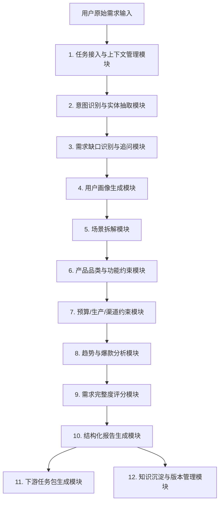
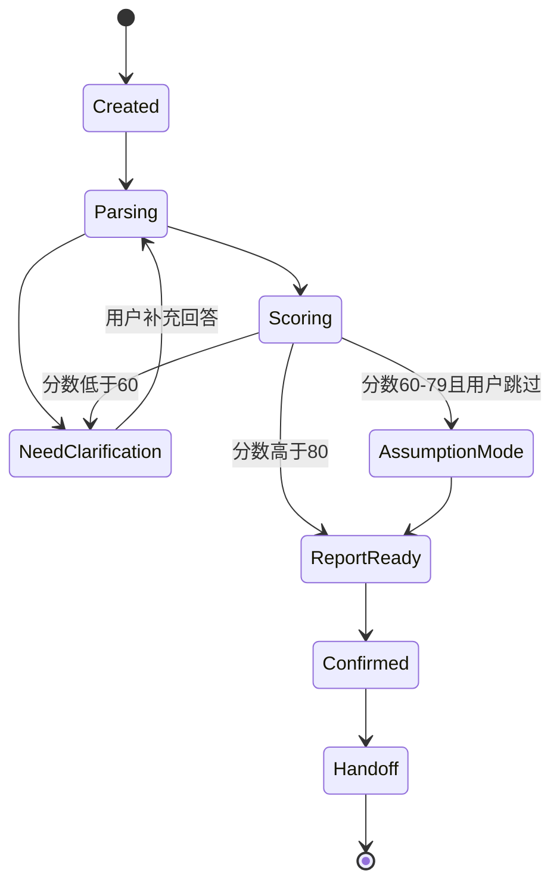

# 需求分析师 Agent 详细功能文档

## 1. 文档目的

本文档用于细化“文化产品智能工厂”系统中的需求分析师 Agent 功能模块。该 Agent 负责接收用户的自然语言需求，通过需求解析、追问澄清、用户画像、场景拆解、产品约束分析、趋势研判和报告生成，将模糊需求转化为结构化、可执行、可被后续 Agent 调用的需求分析报告。

## 2. Agent 定位

需求分析师 Agent 是整个多智能体系统的需求入口，承担“把用户想法变成产品任务书”的角色。

它的核心价值包括：

- 将用户一句话需求拆解为明确的产品目标。
- 识别用户没有说清楚但会影响设计结果的关键问题。
- 生成目标人群、使用场景、产品品类、预算、风格、功能和渠道等结构化字段。
- 为文化 IP 设计师 Agent 提供文化偏好、场景语义和产品边界。
- 为设计师 Agent 提供可落地的设计任务、约束条件和优先级。
- 为营销师 Agent 提供目标人群、传播渠道和核心卖点方向。

## 3. 总体功能架构



## 4. 输入与输出

### 4.1 输入

| 输入来源 | 输入内容 | 示例 | 必需 |
| --- | --- | --- | --- |
| 用户自然语言 | 原始需求描述 | “为 3 月西湖春游的新婚人群设计一套丝绸伴手礼” | 是 |
| 主调度 Agent | 项目上下文 | 项目 ID、品牌、渠道、截止时间 | 否 |
| 历史方案库 | 相似项目资料 | 婚庆礼盒、南浔丝绸礼品案例 | 否 |
| 用户画像库 | 已有人群标签 | 年龄、职业、消费能力、风格偏好 | 否 |
| 趋势数据源 | 热词、爆款、平台数据 | 小红书热词、抖音种草视频、电商榜单 | 否 |
| 企业资料 | 品牌、供应链、工艺能力 | 南浔丝绸产业园、辑里湖丝、真丝品类 | 否 |

### 4.2 输出

| 输出对象 | 输出内容 | 用途 |
| --- | --- | --- |
| 用户 | 需求澄清问题、需求分析摘要 | 让用户确认方向 |
| 主调度 Agent | 结构化需求报告 | 进入后续流程 |
| 文化 IP 设计师 Agent | 文化偏好、场景语义、人群情绪、禁忌线索 | 生成文化 IP |
| 设计师 Agent | 品类、风格、功能、材质、预算、交付物要求 | 生成设计方案 |
| 营销师 Agent | 目标人群、渠道、卖点、传播场景 | 生成营销素材 |
| 方案库 | 可复用需求资产 | 后续检索和复用 |

## 5. 功能模块详解

## 5.1 任务接入与上下文管理模块

### 5.1.1 模块目标

统一接收来自用户或主调度 Agent 的需求任务，建立项目上下文，生成需求分析任务 ID，并管理多轮对话中的状态。

### 5.1.2 主要功能

1. 创建需求分析任务。
2. 绑定用户输入、项目 ID、品牌、渠道、时间、业务线等上下文。
3. 记录对话轮次、用户补充信息和系统假设。
4. 判断任务类型：新品开发、方案优化、趋势调研、礼品定制、营销转化等。
5. 维护当前需求状态：待澄清、分析中、待确认、已完成、需人工介入。

### 5.1.3 输入字段

```json
{
  "project_id": "proj_001",
  "user_input": "为3月西湖春游的新婚人群设计一套丝绸伴手礼",
  "brand_context": "南浔丝绸文化产业园",
  "target_channel": ["小红书", "线下文创店"],
  "deadline": "2026-06-15",
  "conversation_id": "conv_001"
}
```

### 5.1.4 输出字段

```json
{
  "demand_task_id": "demand_001",
  "task_type": "新品开发",
  "status": "待澄清",
  "context_summary": "面向新婚人群的西湖春游丝绸伴手礼需求"
}
```

### 5.1.5 处理逻辑

1. 接收任务后生成唯一任务 ID。
2. 抽取基础上下文，包括品牌、时间、地点、渠道。
3. 判断是否存在历史对话或历史方案。
4. 将上下文传递给后续意图识别模块。
5. 每次用户补充信息后更新任务状态。

### 5.1.6 验收标准

- 同一项目下多轮对话信息不得丢失。
- 系统应能区分用户明确表达、系统推断和默认假设。
- 支持任务暂停后恢复分析。

### 5.1.7 优先级

P0，MVP 必须实现。

## 5.2 意图识别与实体抽取模块

### 5.2.1 模块目标

从用户自然语言中识别设计任务意图和关键实体，为后续需求分析提供基础字段。

### 5.2.2 可识别意图

| 意图类型 | 说明 | 示例 |
| --- | --- | --- |
| 新品设计 | 从零开发一套产品 | “设计一套丝绸伴手礼” |
| 旧方案优化 | 在已有方案上修改 | “把上次那个礼盒做得更年轻一点” |
| 趋势调研 | 分析市场方向 | “最近小红书上什么丝巾风格比较火” |
| 人群洞察 | 分析目标用户 | “年轻新娘喜欢什么样的婚庆丝绸产品” |
| 品类选择 | 帮用户选择产品形态 | “南浔城市礼品适合做什么品类” |
| 商业落地 | 关注成本、渠道和销量 | “这个方案适不适合抖音卖” |

### 5.2.3 实体抽取维度

| 实体类别 | 示例 |
| --- | --- |
| 时间 | 3 月、春季、七夕、中秋、婚礼季 |
| 地点 | 西湖、南浔、湖州、杭州、江南 |
| 人群 | 新婚人群、游客、商务客户、年轻女性 |
| 品类 | 丝巾、香囊、家居服、礼盒、团扇 |
| 材质 | 真丝、绸缎、宋锦、棉麻 |
| 场景 | 婚礼回礼、春游、展会、商务赠礼 |
| 风格 | 新中式、国潮、江南、极简、高级 |
| 预算 | 99-199 元、300-500 元、千元以上 |
| 渠道 | 小红书、抖音、淘宝、景区文创店 |
| 情绪 | 浪漫、吉祥、温柔、喜庆、松弛 |
| 文化 | 西湖、辑里湖丝、并蒂莲、喜鹊、宋韵 |

### 5.2.4 输出示例

```json
{
  "intent": {
    "primary": "新品设计",
    "secondary": ["婚庆礼品", "文旅伴手礼"],
    "confidence": 0.91
  },
  "entities": {
    "time": ["3月", "春季"],
    "location": ["西湖"],
    "target_user": ["新婚人群"],
    "category": ["丝绸伴手礼"],
    "scenario": ["春游", "婚庆"],
    "material": ["丝绸"],
    "culture": ["西湖", "婚嫁"]
  },
  "explicit_fields": ["time", "location", "target_user", "category", "material"],
  "inferred_fields": ["scenario", "emotion", "channel"]
}
```

### 5.2.5 处理逻辑

1. 对用户输入进行分词、实体识别和语义分类。
2. 将自然语言映射到系统标准字段。
3. 标记字段来源：用户明确表达、上下文继承、系统推断、历史案例推荐。
4. 为每个字段生成置信度。
5. 将低置信度字段交给追问模块。

### 5.2.6 验收标准

- 典型单句需求中至少抽取人群、品类、场景、文化线索、材质或地点中的 5 类字段。
- 不得将推断信息标记为用户明确输入。
- 支持中文口语、短句、带错别字的输入。

### 5.2.7 优先级

P0，MVP 必须实现。

## 5.3 需求缺口识别与追问模块

### 5.3.1 模块目标

判断当前需求信息是否足够进入后续设计流程，并根据缺失字段生成高价值、低打扰的追问。

### 5.3.2 缺口类型

| 缺口类型 | 影响 | 示例 |
| --- | --- | --- |
| 人群不清 | 无法判断审美、价格和渠道 | “年轻人”过于宽泛 |
| 场景不清 | 无法判断产品形态和包装 | 是婚礼回礼还是景区零售 |
| 品类不清 | 无法进入设计生产 | 只说“文创产品” |
| 预算不清 | 无法判断材质和工艺 | 不知道单套 99 元还是 599 元 |
| 风格不清 | 视觉方向容易偏差 | 不知道偏国潮还是江南雅致 |
| 渠道不清 | 交付物规格不同 | 小红书种草和线下礼赠差异很大 |
| 生产约束不清 | 影响落地 | 是否量产、是否可用刺绣 |

### 5.3.3 追问策略

1. 一轮最多问 3 个问题。
2. 优先问会影响方案方向的问题。
3. 问题应提供可选项，减少用户输入负担。
4. 如果用户不回答，系统应给出默认假设继续推进。
5. 多轮追问不超过 3 轮，超过后建议人工介入或进入假设模式。

### 5.3.4 追问模板

| 场景 | 追问 |
| --- | --- |
| 产品用途不清 | “这套产品主要用于婚礼回礼、景区零售，还是商务赠礼？” |
| 预算不清 | “期望单套价格更接近 99-199 元、300-500 元，还是高端定制？” |
| 品类不清 | “你更倾向丝巾、香囊、团扇、礼盒组合，还是让系统推荐品类？” |
| 风格不清 | “整体希望偏江南清雅、新中式喜庆，还是年轻国潮？” |
| 渠道不清 | “后续主要用于小红书种草、抖音电商，还是线下文旅店销售？” |

### 5.3.5 输出示例

```json
{
  "need_clarification": true,
  "missing_fields": ["budget_range", "primary_usage", "product_category"],
  "questions": [
    {
      "field": "primary_usage",
      "question": "这套伴手礼主要用于婚礼回礼、景区零售，还是品牌商务赠礼？",
      "options": ["婚礼回礼", "景区零售", "品牌商务赠礼", "多场景兼用"]
    },
    {
      "field": "budget_range",
      "question": "期望单套预算大致是多少？",
      "options": ["99-199元", "300-500元", "500元以上", "暂不确定"]
    }
  ]
}
```

### 5.3.6 验收标准

- 追问应精准指向缺失字段。
- 不应重复询问用户已经回答的信息。
- 用户回答后应能自动更新对应字段。
- 用户选择“暂不确定”时，应自动生成合理假设并标注。

### 5.3.7 优先级

P0，MVP 必须实现。

## 5.4 用户画像生成模块

### 5.4.1 模块目标

基于用户需求、历史案例和趋势数据，生成目标消费人群画像，帮助后续 Agent 理解“谁会买、为什么买、怎么被打动”。

### 5.4.2 画像维度

| 维度 | 内容 |
| --- | --- |
| 基础属性 | 年龄、性别倾向、地域、职业、收入区间 |
| 购买角色 | 购买者、使用者、赠送对象、决策者 |
| 消费动机 | 礼赠、纪念、穿搭、收藏、身份表达 |
| 审美偏好 | 新中式、江南、国潮、极简、华丽 |
| 功能偏好 | 舒适、防皱、便携、耐用、好打理 |
| 情绪诉求 | 浪漫、吉祥、松弛、高级、温柔 |
| 渠道行为 | 小红书搜索、抖音种草、淘宝比价、线下体验 |
| 决策障碍 | 怕贵、怕不实用、怕土气、怕没有故事 |

### 5.4.3 画像类型

1. 核心用户画像：最可能购买或使用的人群。
2. 次级用户画像：可能被影响或参与决策的人群。
3. 渠道用户画像：不同平台上的用户关注点。
4. 礼赠关系画像：购买者和使用者不一致时的关系链。

### 5.4.4 输出示例

```json
{
  "primary_persona": {
    "name": "重视仪式感的新婚女性",
    "age_range": "25-35",
    "role": "购买者/使用者",
    "motivations": ["婚礼纪念", "拍照出片", "表达祝福"],
    "pain_points": ["普通伴手礼同质化", "担心传统婚庆风格太俗", "希望礼物实用"],
    "aesthetic_preferences": ["江南清雅", "春日感", "轻新中式"],
    "design_implications": ["色彩避免厚重大红", "强调同心与春日", "产品应便携且适合拍照"]
  },
  "secondary_persona": {
    "name": "婚礼宾客与亲友",
    "role": "接受礼物者",
    "motivations": ["收到体面礼物", "感受新人用心"],
    "design_implications": ["包装要有仪式感", "产品要适合长期保存"]
  }
}
```

### 5.4.5 验收标准

- 至少输出一个核心画像和一个次级画像。
- 每个画像必须包含动机、痛点和设计启示。
- 不得输出歧视性、敏感或无依据的人群判断。

### 5.4.6 优先级

P0，MVP 必须实现。

## 5.5 场景拆解模块

### 5.5.1 模块目标

将用户需求拆解为具体使用场景、购买场景、传播场景和生产交付场景，使后续设计不只满足“好看”，也满足实际使用。

### 5.5.2 场景类型

| 场景类型 | 说明 | 示例 |
| --- | --- | --- |
| 使用场景 | 产品实际被使用的地方 | 春游佩戴、婚礼回礼、家居穿着 |
| 购买场景 | 用户在哪里购买 | 景区文创店、淘宝、直播间 |
| 赠送场景 | 礼品从谁给谁 | 新人送宾客、企业送客户 |
| 展示场景 | 产品如何被展示 | 礼盒陈列、详情页主图、短视频 |
| 传播场景 | 用户为什么愿意分享 | 拍照出片、文化故事、仪式感 |
| 生产场景 | 是否适合量产 | 小批量定制、大货生产 |

### 5.5.3 场景拆解输出

```json
{
  "scenario_map": [
    {
      "scenario": "婚礼回礼",
      "user_goal": "表达新人祝福与礼品体面感",
      "product_requirements": ["包装有仪式感", "寓意吉祥", "适合批量采购"],
      "design_requirements": ["婚嫁符号明确但不过度俗气", "色彩温柔喜庆"]
    },
    {
      "scenario": "西湖春游纪念",
      "user_goal": "与旅行记忆绑定，适合拍照分享",
      "product_requirements": ["便携", "轻量", "可作为穿搭配饰"],
      "design_requirements": ["春日色彩", "西湖地域识别", "画面清新"]
    }
  ]
}
```

### 5.5.4 验收标准

- 至少识别使用、购买、传播三个维度。
- 每个场景应转化为产品要求和设计要求。
- 多场景需求应标记主场景和次场景，避免方案发散。

### 5.5.5 优先级

P0，MVP 必须实现。

## 5.6 产品品类与功能约束模块

### 5.6.1 模块目标

根据人群、场景、预算和文化表达需求，推荐适合的产品品类组合，并生成每个品类的功能约束。

### 5.6.2 品类库

| 品类 | 适用场景 | 优点 | 约束 |
| --- | --- | --- | --- |
| 丝巾 | 礼赠、穿搭、文旅纪念 | 容易承载图案，适合拍照 | 成本受材质和尺寸影响 |
| 香囊 | 婚庆、节庆、伴手礼 | 小巧、寓意好、适合组合 | 文化符号需要谨慎 |
| 团扇 | 婚礼、国风拍照 | 仪式感强，视觉展示好 | 实用频次较低 |
| 家居服/晨袍 | 婚庆、家居、旅拍 | 使用价值高 | 尺码和版型复杂 |
| 礼盒 | 商务、婚庆、文旅 | 提升价值感 | 包装成本和物流体积高 |
| 丝绸画 | 商务礼赠、收藏 | 高端、有文化感 | 大众消费门槛较高 |
| 书签/小件配饰 | 景区零售 | 成本低、易购买 | 承载故事有限 |

### 5.6.3 推荐逻辑

1. 根据主场景筛选品类。
2. 根据预算排除成本不匹配品类。
3. 根据文化故事承载能力排序。
4. 根据渠道适配度生成组合方案。
5. 输出主品类、辅助品类和可选延展品类。

### 5.6.4 输出示例

```json
{
  "recommended_categories": [
    {
      "category": "真丝小方巾",
      "role": "主产品",
      "reason": "适合承载西湖与婚嫁纹样，兼具穿搭和纪念价值",
      "functional_constraints": ["防皱", "亲肤", "边缘工艺精致", "适合礼盒陈列"]
    },
    {
      "category": "香囊",
      "role": "辅助产品",
      "reason": "符合婚庆伴手礼小件组合，可表达祝福寓意",
      "functional_constraints": ["香味不刺激", "图案面积有限", "适合批量生产"]
    }
  ],
  "not_recommended": [
    {
      "category": "大幅丝绸画",
      "reason": "不适合春游携带，预算和使用频次可能不匹配"
    }
  ]
}
```

### 5.6.5 验收标准

- 推荐结果必须说明原因。
- 应输出不推荐品类及理由。
- 功能约束要能传递给设计师 Agent。

### 5.6.6 优先级

P1，建议 MVP 实现基础版。

## 5.7 预算、生产与渠道约束模块

### 5.7.1 模块目标

把预算、生产工艺、供应链能力和销售渠道转化为设计约束，避免后续方案无法落地。

### 5.7.2 预算层级

| 预算层级 | 单套价格 | 适合策略 |
| --- | --- | --- |
| 入门款 | 99-199 元 | 小件产品、标准包装、少量工艺 |
| 中端款 | 300-500 元 | 丝巾+香囊+礼盒组合 |
| 高端款 | 500-1000 元 | 真丝材质、刺绣/烫金、定制礼盒 |
| 收藏款 | 1000 元以上 | 限量编号、非遗工艺、证书与故事册 |

### 5.7.3 生产约束

| 约束 | 影响 |
| --- | --- |
| 起订量 | 影响是否能小批量定制 |
| 材质 | 影响成本、质感和工艺 |
| 工艺 | 刺绣、提花、印花、烫金的成本差异 |
| 交期 | 影响是否能做复杂打样 |
| 尺寸 | 影响图案构图和包装 |
| 供应链 | 影响是否能使用特殊面料或工艺 |

### 5.7.4 渠道约束

| 渠道 | 重点 |
| --- | --- |
| 小红书 | 拍照效果、故事感、生活方式表达 |
| 抖音 | 视觉冲击、价格卖点、短视频转化 |
| 淘宝/天猫 | 参数完整、详情页说服、评价转化 |
| 线下文旅店 | 货架识别、包装质感、即时购买 |
| 商务礼赠 | 品牌背书、文化解释、礼盒体面 |

### 5.7.5 输出示例

```json
{
  "budget_assumption": "300-500元/套",
  "production_constraints": {
    "material": "真丝或真丝混纺",
    "recommended_craft": ["数码印花", "局部烫金"],
    "avoid_craft": ["大面积手工刺绣"],
    "reason": "中端预算下需兼顾质感和批量生产"
  },
  "channel_constraints": {
    "xiaohongshu": ["需要高颜值开箱图", "故事文案要轻盈"],
    "offline_gift_shop": ["包装需一眼识别西湖和婚庆属性"]
  }
}
```

### 5.7.6 验收标准

- 预算未知时必须给出假设并标注。
- 约束必须能转化为设计限制或推荐。
- 不应推荐明显超出预算的工艺方案。

### 5.7.7 优先级

P1，建议 MVP 实现基础预算判断。

## 5.8 趋势与爆款分析模块

### 5.8.1 模块目标

接入外部平台和内部历史数据，辅助判断需求方向是否符合市场趋势，并生成品类、风格、色彩和元素趋势建议。

### 5.8.2 数据来源

| 数据来源 | 内容 |
| --- | --- |
| 小红书 | 热门笔记、标题、正文、标签、互动量 |
| 抖音 | 视频标题、话题、评论、点赞、转发 |
| 电商平台 | 热销榜单、商品标题、评论、价格 |
| Pinterest/Instagram | 图像风格、色彩、元素趋势 |
| 专业资讯 | WGSN、Vogue Runway、时装周 |
| 内部方案库 | 已上线产品表现、销售、收藏、复购 |

### 5.8.3 分析能力

1. 热词提取：如“新中式”“松弛感”“多巴胺”“宋韵”。
2. 元素热度：如莲花、蝴蝶、花卉、几何、窗棂。
3. 色彩趋势：提取主色、辅色、流行色盘。
4. 情感倾向：识别用户喜欢、不满和痛点。
5. 爆款预测：根据历史爆款特征对方案方向打分。
6. 趋势阶段判断：爆发期、稳定期、衰退期。

### 5.8.4 输出示例

```json
{
  "trend_summary": {
    "time_range": "近30天",
    "data_sources": ["小红书", "抖音电商", "内部历史方案库"],
    "hot_keywords": ["新中式", "春日穿搭", "婚礼伴手礼", "丝巾"],
    "rising_elements": ["莲花", "水波纹", "浅粉色系", "轻礼盒"],
    "declining_elements": ["厚重大红金婚庆风", "复杂龙凤纹"],
    "suggestion": "建议采用轻新中式和春日江南风，弱化传统厚重婚庆表达"
  }
}
```

### 5.8.5 验收标准

- 输出趋势必须标注数据来源和时间范围。
- 实时数据不可用时，应明确标注“基于历史样本推断”。
- 趋势结论要转化为设计建议，而不是只列热词。

### 5.8.6 优先级

P2，MVP 可先使用内部样本和人工维护趋势库。

## 5.9 需求完整度评分模块

### 5.9.1 模块目标

评价当前需求是否足够进入文化 IP 和设计阶段，并决定继续追问、带假设推进或人工介入。

### 5.9.2 评分维度

| 维度 | 权重 | 说明 |
| --- | --- | --- |
| 目标人群清晰度 | 20% | 是否知道为谁设计 |
| 使用场景清晰度 | 20% | 是否知道在哪里用、为什么用 |
| 产品品类清晰度 | 15% | 是否知道做什么产品 |
| 预算/生产约束清晰度 | 15% | 是否知道成本和落地边界 |
| 风格/文化偏好清晰度 | 20% | 是否知道审美和文化方向 |
| 渠道/交付物清晰度 | 10% | 是否知道输出规格 |

### 5.9.3 评分结果

| 分数 | 处理建议 |
| --- | --- |
| 0-59 | 继续追问，不建议进入设计 |
| 60-79 | 可进入下一阶段，但需标注假设 |
| 80-100 | 可直接进入文化 IP 和设计阶段 |

### 5.9.4 输出示例

```json
{
  "completeness_score": 76,
  "level": "可推进但需确认",
  "weak_fields": ["budget_range", "production_quantity"],
  "recommended_action": "进入文化IP生成，同时向用户确认预算和数量",
  "assumptions": [
    "默认单套预算为300-500元",
    "默认产品用于婚礼回礼和春游纪念双场景"
  ]
}
```

### 5.9.5 验收标准

- 评分必须能解释扣分原因。
- 弱字段必须对应追问或默认假设。
- 评分不能只作为展示，应影响工作流状态。

### 5.9.6 优先级

P0，MVP 必须实现。

## 5.10 结构化报告生成模块

### 5.10.1 模块目标

将前面各模块的结果整理为标准化《需求分析报告》，供用户确认和下游 Agent 调用。

### 5.10.2 报告章节

1. 项目概述。
2. 原始需求复述。
3. 需求理解与系统假设。
4. 目标人群画像。
5. 使用场景与购买场景。
6. 产品品类建议。
7. 功能需求与体验需求。
8. 风格、情绪与文化偏好。
9. 预算、生产和渠道约束。
10. 趋势洞察与市场机会。
11. 需求完整度评分。
12. 待确认问题。
13. 下游 Agent 任务建议。

### 5.10.3 结构化 JSON 输出

```json
{
  "report_id": "dr_001",
  "project_summary": "西湖春日婚庆丝绸伴手礼",
  "original_requirement": "为3月西湖春游的新婚人群设计一套丝绸伴手礼",
  "confirmed_fields": {
    "target_users": ["新婚夫妇", "婚礼宾客"],
    "usage_scenarios": ["婚礼回礼", "春游纪念"],
    "material": ["丝绸"]
  },
  "assumptions": {
    "budget_range": "300-500元",
    "channel": ["小红书", "线下文创店"]
  },
  "personas": [],
  "scenario_map": [],
  "product_recommendations": [],
  "trend_summary": {},
  "completeness_score": 76,
  "pending_questions": []
}
```

### 5.10.4 验收标准

- 报告应同时支持人类阅读版和机器调用版。
- 机器调用版字段稳定，便于后续 Agent 接口对接。
- 报告必须明确区分“已确认信息”和“系统假设”。

### 5.10.5 优先级

P0，MVP 必须实现。

## 5.11 下游任务包生成模块

### 5.11.1 模块目标

将需求报告转化为不同下游 Agent 可直接执行的任务包。

### 5.11.2 文化 IP 设计师任务包

```json
{
  "agent": "cultural_ip_agent",
  "task": "生成文化IP方向",
  "inputs": {
    "target_users": ["新婚夫妇"],
    "usage_scenarios": ["婚礼回礼", "西湖春游纪念"],
    "cultural_keywords": ["西湖", "婚嫁", "丝绸", "江南"],
    "emotional_keywords": ["浪漫", "吉祥", "温柔", "春日"],
    "risk_hints": ["避免悲情爱情典故", "避免孤独意象"]
  },
  "expected_outputs": ["故事内核", "符号体系", "文化依据", "禁忌风险", "设计转译建议"]
}
```

### 5.11.3 设计师任务包

```json
{
  "agent": "designer_agent",
  "task": "生成丝绸伴手礼视觉方案",
  "inputs": {
    "product_categories": ["丝巾", "香囊", "礼盒"],
    "style": ["江南清雅", "轻新中式"],
    "functional_requirements": ["便携", "防皱", "适合拍照"],
    "budget_constraints": "300-500元/套"
  },
  "expected_outputs": ["纹样方案", "配色方案", "包装草图", "产品效果图"]
}
```

### 5.11.4 验收标准

- 每个任务包必须包含输入、输出和约束。
- 不同 Agent 只接收与自身职责相关的信息。
- 下游 Agent 执行失败时，可追溯到原始需求字段。

### 5.11.5 优先级

P1。

## 5.12 知识沉淀与版本管理模块

### 5.12.1 模块目标

将需求分析过程、用户确认结果、最终报告和后续方案效果沉淀到方案库，用于后续 RAG 检索和模型优化。

### 5.12.2 存储内容

| 内容 | 用途 |
| --- | --- |
| 原始需求 | 复盘用户表达 |
| 追问与回答 | 优化追问策略 |
| 结构化字段 | 后续相似需求检索 |
| 系统假设 | 追踪方案偏差来源 |
| 最终确认报告 | 方案库资产 |
| 后续设计方案 | 建立需求到设计的映射 |
| 销售/反馈数据 | 优化推荐和预测 |

### 5.12.3 版本管理规则

1. 每次用户修改关键字段生成新版本。
2. 版本号格式建议为 `v1.0`、`v1.1`、`v2.0`。
3. 小修改更新小版本，大方向变更更新大版本。
4. 保留版本差异说明。
5. 下游 Agent 应绑定具体版本，避免引用错乱。

### 5.12.4 验收标准

- 能查看任意版本报告。
- 能比较两个版本的字段差异。
- 能追踪某个设计方案基于哪个需求版本生成。

### 5.12.5 优先级

P1。

## 6. 对外接口设计

## 6.1 创建需求分析任务

```http
POST /v1/agents/demand-analysis/tasks
```

```json
{
  "user_input": "为3月西湖春游的新婚人群设计一套丝绸伴手礼",
  "context": {
    "brand": "南浔丝绸文化产业园",
    "target_channel": ["xiaohongshu", "offline_store"]
  }
}
```

```json
{
  "demand_task_id": "demand_001",
  "status": "analyzing"
}
```

## 6.2 获取追问问题

```http
GET /v1/agents/demand-analysis/tasks/{demand_task_id}/questions
```

```json
{
  "need_clarification": true,
  "questions": [
    {
      "field": "budget_range",
      "question": "期望单套预算大致是多少？",
      "options": ["99-199元", "300-500元", "500元以上"]
    }
  ]
}
```

## 6.3 提交用户回答

```http
POST /v1/agents/demand-analysis/tasks/{demand_task_id}/answers
```

```json
{
  "answers": {
    "budget_range": "300-500元",
    "primary_usage": "婚礼回礼"
  }
}
```

## 6.4 获取需求分析报告

```http
GET /v1/agents/demand-analysis/tasks/{demand_task_id}/report
```

```json
{
  "report_id": "dr_001",
  "status": "completed",
  "completeness_score": 86,
  "report_markdown": "string",
  "report_json": {}
}
```

## 6.5 生成下游任务包

```http
POST /v1/agents/demand-analysis/tasks/{demand_task_id}/handoff
```

```json
{
  "target_agents": ["cultural_ip_agent", "designer_agent"]
}
```

## 7. 状态机设计



## 8. 数据模型建议

### 8.1 DemandTask

| 字段 | 类型 | 说明 |
| --- | --- | --- |
| demand_task_id | string | 任务 ID |
| project_id | string | 项目 ID |
| user_input | string | 原始需求 |
| status | string | 当前状态 |
| context | object | 项目上下文 |
| created_at | datetime | 创建时间 |
| updated_at | datetime | 更新时间 |

### 8.2 DemandField

| 字段 | 类型 | 说明 |
| --- | --- | --- |
| field_name | string | 字段名 |
| field_value | any | 字段值 |
| source | string | explicit/inferred/assumption/user_confirmed |
| confidence | float | 置信度 |
| version | string | 版本 |

### 8.3 DemandReport

| 字段 | 类型 | 说明 |
| --- | --- | --- |
| report_id | string | 报告 ID |
| demand_task_id | string | 关联任务 |
| markdown | string | 人类阅读版 |
| structured_json | object | 机器调用版 |
| completeness_score | int | 完整度评分 |
| version | string | 报告版本 |

## 9. 权限与安全

1. 用户上传的品牌资料、销售数据和内部方案应按项目隔离。
2. 外部趋势数据采集应遵守平台规则。
3. 人群画像不得包含无必要的敏感个人信息。
4. 系统推断必须标注来源，避免误导用户。
5. 需求报告修改应保留操作记录。

## 10. MVP 范围

### 10.1 P0 必须实现

- 任务接入与上下文管理。
- 意图识别与实体抽取。
- 需求缺口识别与追问。
- 用户画像生成基础版。
- 场景拆解基础版。
- 需求完整度评分。
- 结构化报告生成。

### 10.2 P1 建议实现

- 品类推荐和功能约束。
- 预算、生产和渠道约束。
- 下游任务包生成。
- 版本管理。

### 10.3 P2 后续增强

- 实时趋势数据接入。
- 爆款预测模型。
- 多平台用户行为分析。
- 自动学习历史成功案例。

## 11. 典型示例

### 11.1 用户输入

```text
为 3 月西湖春游的新婚人群设计一套丝绸伴手礼。
```

### 11.2 系统追问

```text
1. 这套伴手礼主要用于婚礼回礼、景区零售，还是品牌商务赠礼？
2. 期望单套预算大致是多少？
3. 是否已有固定产品品类，例如丝巾、香囊或礼盒？
```

### 11.3 用户回答

```text
主要用于婚礼回礼和春游纪念，预算 300-500 元，品类可以是丝巾、香囊和礼盒组合。
```

### 11.4 输出摘要

```json
{
  "project_summary": "西湖春日婚庆丝绸伴手礼",
  "target_users": ["新婚夫妇", "婚礼宾客"],
  "usage_scenarios": ["婚礼回礼", "春游纪念"],
  "product_categories": ["真丝小方巾", "香囊", "礼盒"],
  "style": ["江南清雅", "轻新中式", "春日感"],
  "emotions": ["浪漫", "吉祥", "温柔"],
  "cultural_keywords": ["西湖", "婚嫁", "丝绸", "江南"],
  "budget_range": "300-500元",
  "completeness_score": 88,
  "next_agent": "文化IP设计师Agent"
}
```

## 12. 验收清单

| 验收项 | 是否必须 |
| --- | --- |
| 能从一句话需求中抽取核心字段 | 是 |
| 能生成不超过 3 个关键追问 | 是 |
| 能根据用户回答更新需求报告 | 是 |
| 能输出目标人群画像 | 是 |
| 能输出场景拆解和产品建议 | 是 |
| 能标注系统假设 | 是 |
| 能生成结构化 JSON 和 Markdown 报告 | 是 |
| 能给出完整度评分 | 是 |
| 能生成下游 Agent 任务包 | 建议 |
| 能接入实时趋势数据 | 后续 |

## 13. 总结

需求分析师 Agent 的建设重点不是单纯“理解一句话”，而是建立一套稳定的需求工程流程。它需要把用户模糊、片段化、口语化的想法，转化为可确认、可评分、可传递、可复用的结构化需求资产。该 Agent 的输出质量会直接影响文化 IP 设计师 Agent 的故事生成、设计师 Agent 的视觉产出和营销师 Agent 的传播转化，因此建议作为整个系统的第一优先级模块建设。
