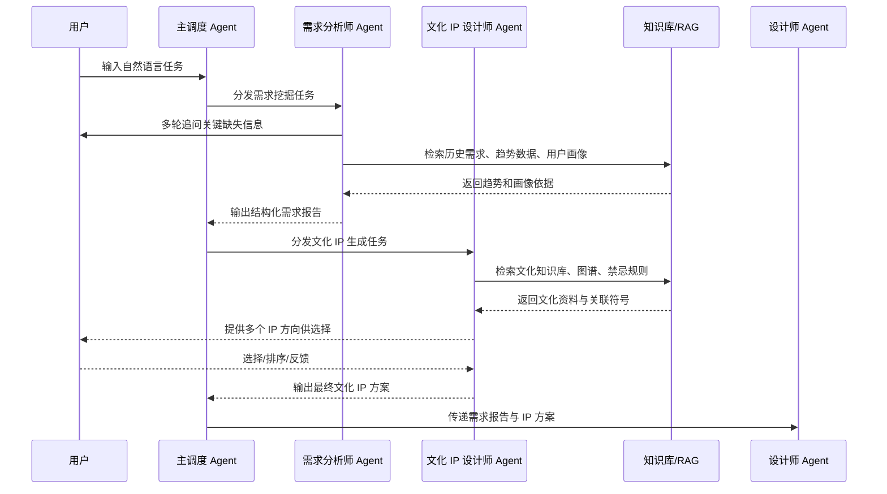

# 需求分析师 Agent 与文化 IP 设计师 Agent 需求分析报告

## 1. 报告背景

本报告基于《多智能体“文化产品智能工厂”系统架构方案》中的前两个核心智能体模块展开：

- 需求分析师 Agent：负责从用户模糊表达中挖掘真实业务需求、用户画像、消费场景和产品约束。
- 文化 IP 设计师 Agent：负责将需求中的地域、节庆、婚嫁、非遗、历史、审美等文化线索转化为可用于产品设计的文化故事、符号体系与 IP 创意方案。

两个 Agent 位于整体工作流的前置环节，决定后续设计师 Agent、营销师 Agent、品控师 Agent 和方案库的输入质量。若需求理解不充分或文化 IP 生成不准确，后续设计、营销和生产环节会出现方向偏差、文化误用、审美不统一和商业转化不足等问题。

## 2. 项目定位

### 2.1 系统总体定位

系统定位为面向丝绸、服饰、家居、文创礼品等文化产品场景的多智能体协作平台，通过“需求理解 - 文化解析 - 设计生成 - 营销转化 - 质量审核 - 方案沉淀”的流程，将用户的自然语言需求转化为可设计、可生产、可销售、可复用的文化产品方案。

### 2.2 两个 Agent 的定位

需求分析师 Agent 是系统的“需求入口”和“商业理解层”。它不直接生成视觉设计，而是负责把用户话语翻译成清晰的产品需求说明书。

文化 IP 设计师 Agent 是系统的“文化创意层”和“故事内核生成器”。它基于需求分析结果，从文化知识库中检索、筛选、组合和解释文化元素，形成有出处、有逻辑、有情感张力的 IP 创意方案。

二者共同构成后续设计生产的上游基础：


## 3. 业务目标

### 3.1 总体目标

构建一套能够理解用户商业诉求、提炼目标人群需求、匹配文化资源并输出可设计化文化 IP 方案的智能体能力，使文化产品开发从“经验驱动”升级为“数据、知识与创意协同驱动”。

### 3.2 需求分析师 Agent 目标

1. 降低用户表达门槛，让非专业用户也能提出完整、可执行的产品设计需求。
2. 将模糊需求结构化，输出目标人群、使用场景、产品品类、预算、风格、材质、功能、文化偏好等字段。
3. 结合趋势数据和历史方案，辅助判断需求是否有市场潜力。
4. 为文化 IP 设计师 Agent 和设计师 Agent 提供稳定、标准化、可追踪的输入。

### 3.3 文化 IP 设计师 Agent 目标

1. 将用户需求中的文化关键词转化为可叙事、可视觉化、可商业化的文化 IP。
2. 通过 RAG 和文化知识图谱减少文化内容幻觉，保证文化解释有据可查。
3. 生成多个差异化 IP 方向，并支持用户或专家选择、排序、收敛。
4. 输出符号体系、故事内核、禁忌边界和设计转译建议，为后续图案、款式、包装和营销提供统一文化母题。

## 4. 用户与使用场景

### 4.1 主要用户

| 用户角色 | 典型诉求 | 使用痛点 |
| --- | --- | --- |
| 文创产品策划人员 | 快速形成新品策划方向 | 缺少系统化需求调研和文化转译能力 |
| 服装/丝绸企业经营者 | 根据市场热点开发可销售产品 | 不知道目标人群真正喜欢什么 |
| 设计师 | 获得清晰需求和文化故事输入 | 用户需求模糊，文化元素不成体系 |
| 电商运营人员 | 需要可传播的卖点和故事 | 产品有图案但缺乏故事包装 |
| 政府园区/产业园运营方 | 推动本地文化资源产业化 | 文化资源多，但缺少产品化路径 |
| 品牌方 | 打造系列化文化 IP 产品 | 容易出现符号堆砌和风格不统一 |

### 4.2 典型业务场景

#### 场景一：婚庆丝绸伴手礼开发

用户输入：“为 3 月西湖春游的新婚人群设计一套丝绸伴手礼。”

需求分析师 Agent 需要追问或推断：

- 目标人群：新婚夫妇、婚礼宾客、伴娘伴郎、长辈亲友。
- 使用场景：婚礼回礼、旅拍纪念、春游伴手礼、订婚礼盒。
- 产品品类：丝巾、香囊、睡袍、喜帕、礼盒、杯垫、团扇等。
- 预算区间：大众礼盒、中高端定制、高端收藏。
- 功能需求：便携、防皱、适合拍照、四季可用、礼盒体面。
- 情绪需求：浪漫、吉祥、温柔、东方婚礼感。

文化 IP 设计师 Agent 需要输出：

- 文化关键词：西湖、春日、婚嫁、鸳鸯、并蒂莲、喜鹊、丝绸、江南。
- 故事方向：西湖春水见证良缘、并蒂莲象征同心、喜鹊传喜、江南丝韵。
- 视觉符号：湖波、柳枝、莲花、双鸟、桥、月、丝线纹理。
- 禁忌提醒：避免使用孤雁、残荷、断桥悲情叙事等可能产生负面婚恋联想的元素。

#### 场景二：南浔辑里湖丝城市礼品开发

用户输入：“想做一款代表南浔丝绸产业园的城市伴手礼。”

需求分析师 Agent 需要明确：

- 产品用途：政府接待、游客购买、产业园品牌传播、展会赠礼。
- 目标受众：游客、经销商、采购商、政府来访人员。
- 价格带：普通游客版、商务礼赠版、收藏版。
- 产品形态：丝巾、丝绸画、礼盒、书签、家居软装、小件配饰。

文化 IP 设计师 Agent 需要提炼：

- 文化母题：辑里湖丝、南浔古镇、江南水乡、丝绸商贸、桑蚕文化。
- 故事内核：一缕湖丝连接江南生活美学与现代产业升级。
- 设计符号：蚕茧、湖水、古桥、窗棂、丝线、商号牌匾。
- 品牌调性：雅致、温润、可信赖、有产业根基。

## 5. 总体工作流

### 5.1 端到端流程



### 5.2 协作边界

| 模块 | 负责内容 | 不负责内容 |
| --- | --- | --- |
| 需求分析师 Agent | 需求澄清、画像生成、场景拆解、趋势研判、产品约束整理 | 文化考据深度解释、图案生成、营销素材生成 |
| 文化 IP 设计师 Agent | 文化检索、故事生成、符号体系、文化禁忌、设计转译建议 | 用户预算确认、产品结构设计、最终视觉图生成 |
| 设计师 Agent | 图案、款式、包装、配色、工艺和 3D 效果 | 原始需求挖掘、文化资料考证 |

## 6. 需求分析师 Agent 详细需求

### 6.1 角色定义

需求分析师 Agent 是系统洞察用户真实需求的智能体，负责从不完整、口语化、模糊化的输入中，识别目标人群、使用场景、产品类型、购买动机、预算约束、审美偏好、功能要求和文化偏好，并生成可被后续 Agent 消费的结构化需求报告。

### 6.2 输入

| 输入类型 | 示例 | 是否必需 |
| --- | --- | --- |
| 用户原始需求 | “做一套适合新婚人群的丝绸伴手礼” | 必需 |
| 目标品类 | 丝巾、家居服、伴手礼、内衣、文创礼品 | 可选 |
| 目标人群 | 新婚人群、年轻女性、商务客户、游客 | 可选 |
| 使用场景 | 婚礼、节庆、旅游、展会、直播电商 | 可选 |
| 预算范围 | 99-199 元、300-500 元、千元以上 | 可选 |
| 参考风格 | 新中式、江南、国潮、极简、高端礼赠 | 可选 |
| 渠道平台 | 小红书、抖音、淘宝、线下文旅店 | 可选 |
| 历史方案 | 已确认的需求报告、产品方案、销售数据 | 可选 |

### 6.3 输出

需求分析师 Agent 输出《结构化需求分析报告》，建议包含以下字段：

```json
{
  "project_name": "西湖春日婚庆丝绸伴手礼",
  "original_requirement": "为3月西湖春游的新婚人群设计一套丝绸伴手礼",
  "target_users": [
    {
      "group": "新婚夫妇",
      "age_range": "25-35",
      "core_motivation": "纪念婚礼与旅行，追求浪漫和仪式感",
      "pain_points": ["礼品同质化", "缺少文化故事", "担心不实用"]
    }
  ],
  "usage_scenarios": ["婚礼回礼", "旅拍纪念", "春季旅游伴手礼"],
  "product_categories": ["丝巾", "香囊", "团扇", "礼盒"],
  "functional_requirements": ["便携", "防皱", "适合拍照", "可长期保存"],
  "aesthetic_preferences": ["江南", "温柔", "新中式", "春日感"],
  "cultural_preferences": ["西湖", "婚嫁", "并蒂莲", "喜鹊"],
  "budget_range": "199-599元",
  "channel_suggestions": ["小红书种草", "婚庆渠道", "景区文创店"],
  "risk_notes": ["避免过度使用悲情爱情典故", "避免颜色过于丧葬化"],
  "missing_information": ["是否需要量产", "是否已有品牌VI", "是否限定具体品类"]
}
```

### 6.4 核心功能需求

#### F1. 自然语言需求解析

系统应支持识别用户输入中的显性信息和隐性信息。

- 显性信息：品类、场景、人群、地点、时间、预算。
- 隐性信息：礼赠关系、情绪诉求、购买动机、文化联想、渠道偏好。
- 输出应包含置信度，便于后续判断是否需要追问。

验收标准：

- 对典型一句话需求，能够提取不少于 5 类核心字段。
- 对缺失字段能自动标记为 unknown 或待确认。
- 不应把推断内容伪装成用户明确表达，应区分“用户已说明”和“系统推断”。

#### F2. 多轮追问与需求澄清

当关键信息缺失时，Agent 应能提出有业务价值的追问。

追问优先级：

1. 产品用途和使用场景。
2. 目标人群和购买者/使用者是否一致。
3. 预算区间和量产规模。
4. 风格偏好和禁忌偏好。
5. 渠道平台和交付物类型。

追问示例：

- “这套伴手礼主要用于婚礼回礼、旅拍纪念，还是景区零售？”
- “购买者是新人本人、婚庆公司，还是景区/品牌方？”
- “希望做大众价格带，还是偏高端定制礼盒？”

验收标准：

- 单轮最多提出 3 个问题，避免用户负担过重。
- 问题应具体可回答，不应只问“请补充更多信息”。
- 用户跳过问题时，系统应基于合理默认值继续生成，并标注假设。

#### F3. 用户画像生成

系统应根据用户输入和历史数据，生成目标消费人群画像。

画像维度：

- 基础属性：年龄、性别倾向、地域、职业、收入水平。
- 消费动机：礼赠、纪念、穿搭、收藏、社交分享。
- 审美偏好：新中式、极简、国潮、复古、华丽、自然。
- 功能偏好：舒适、防皱、耐用、便携、环保、四季可用。
- 内容偏好：爱情、吉祥、地域、非遗、节庆、身份表达。

验收标准：

- 至少输出 1 个核心画像和 1 个潜在人群画像。
- 每个画像包含动机、痛点和设计启示。
- 能支持不同渠道的画像差异，例如小红书用户更关注拍照和故事，电商用户更关注价格和实用。

#### F4. 场景与任务拆解

Agent 应将用户需求拆解为可执行设计任务。

拆解字段：

- 产品品类任务：需要设计哪些产品。
- 内容任务：需要哪些文化主题、故事、文案。
- 视觉任务：需要哪些风格、色彩、符号。
- 工艺任务：是否涉及丝绸材质、刺绣、提花、印花、包装。
- 渠道任务：是否需要适配小红书、抖音、电商、线下陈列。

验收标准：

- 输出任务应能直接传递给文化 IP 设计师 Agent 和设计师 Agent。
- 每个任务应有输入、输出和优先级。
- 对不适合当前项目阶段的任务应标记为后置任务。

#### F5. 趋势与爆款分析接入

需求分析师 Agent 应支持调用趋势数据，辅助判断用户需求是否符合市场趋势。

数据来源可包括：

- 社交媒体：小红书、抖音、Instagram、Pinterest。
- 电商平台：淘宝、天猫、抖音电商、京东、Shopify。
- 专业资讯：WGSN、Vogue Runway、中国国际时装周。
- 搜索指数：百度指数、微信指数。
- 内部数据：历史方案、点击率、收藏率、转化率、复购率。

分析能力：

- 高频关键词提取。
- 情感倾向分析。
- 图像风格识别。
- 色彩趋势聚类。
- 元素热度追踪。
- 未来 2-4 周潜力爆款预测。

验收标准：

- 输出趋势结论时必须给出数据来源和时间范围。
- 趋势建议应区分“强趋势”“稳定趋势”“衰退趋势”。
- 对缺少实时数据的情况，应明确提示“基于历史知识/内部样本推断”。

#### F6. 需求完整度评分

Agent 应对当前需求是否足以进入文化 IP 生成和设计阶段进行评分。

评分维度：

| 维度 | 权重建议 |
| --- | --- |
| 目标人群清晰度 | 20% |
| 使用场景清晰度 | 20% |
| 产品品类清晰度 | 15% |
| 预算和生产约束清晰度 | 15% |
| 风格和文化偏好清晰度 | 20% |
| 渠道和交付物清晰度 | 10% |

验收标准：

- 总分低于 60 分时，应建议继续澄清。
- 总分 60-80 分时，可进入下一阶段，但需标注关键假设。
- 总分高于 80 分时，可直接进入文化 IP 生成。

### 6.5 非功能需求

| 类别 | 要求 |
| --- | --- |
| 准确性 | 对核心字段抽取准确率应达到可评审标准，关键字段不得随意编造 |
| 可解释性 | 每个重要推断应说明依据，如用户输入、历史案例或趋势数据 |
| 可复用性 | 输出字段应结构化，便于存入方案库和后续检索 |
| 可交互性 | 支持多轮对话、用户修正和版本记录 |
| 响应速度 | 普通需求解析建议 5 秒内完成，调用外部趋势数据可异步返回 |
| 安全性 | 不应采集无授权个人隐私数据，不应输出歧视性用户画像 |

## 7. 文化 IP 设计师 Agent 详细需求

### 7.1 角色定义

文化 IP 设计师 Agent 是系统讲故事和做文化转译的智能体。它根据结构化需求报告，从文化知识库、图数据库和历史方案库中检索相关文化资源，并生成可用于图案、款式、包装、营销传播的 IP 创意方向。

它的核心价值不是“堆砌传统元素”，而是建立“文化依据 - 情绪价值 - 视觉符号 - 产品应用”的转译链路。

### 7.2 输入

| 输入类型 | 示例 | 是否必需 |
| --- | --- | --- |
| 结构化需求报告 | 需求分析师 Agent 输出结果 | 必需 |
| 文化关键词 | 西湖、婚嫁、丝绸、江南 | 可选 |
| 地域信息 | 南浔、西湖、杭州、湖州 | 可选 |
| 节庆/仪式 | 婚礼、七夕、中秋、春节 | 可选 |
| 用户偏好 | 浪漫、吉祥、高级、年轻化 | 可选 |
| 禁忌要求 | 避免悲情典故、避免宗教敏感 | 可选 |
| 参考资料 | 文献、博物馆图录、网页链接、图片 | 可选 |

### 7.3 输出

文化 IP 设计师 Agent 输出《文化 IP 创意方案》，建议包含：

```json
{
  "ip_theme": "西湖并蒂春禧",
  "core_story": "以西湖春水、并蒂莲与江南丝绸为核心，表达新人同心、春日新生与长久相伴的婚嫁祝福。",
  "cultural_sources": [
    {
      "name": "并蒂莲",
      "meaning": "同心、连理、婚嫁祝福",
      "source_type": "传统吉祥符号",
      "relevance_score": 0.92
    }
  ],
  "symbol_system": [
    {
      "symbol": "并蒂莲",
      "visual_feature": "双花同茎、圆润花瓣、柔和水纹",
      "design_usage": "主纹样、礼盒封面、丝巾中心图案"
    },
    {
      "symbol": "喜鹊",
      "visual_feature": "双鸟相向、尾羽轻盈",
      "design_usage": "边角装饰、包装烫金小标"
    }
  ],
  "emotional_keywords": ["同心", "新生", "温柔", "春日", "吉祥"],
  "visual_translation": {
    "colors": ["浅粉", "湖蓝", "米白", "嫩柳绿", "淡金"],
    "patterns": ["水波纹", "莲花纹", "双鸟纹", "丝线纹"],
    "style": "江南新中式"
  },
  "negative_association_risks": ["断桥悲情叙事", "孤鸟意象", "过深黑白配色"],
  "recommended_ip_directions": [
    "爱情祝福型",
    "江南春游型",
    "非遗丝绸型"
  ]
}
```

### 7.4 核心功能需求

#### F1. 文化关键词识别与扩展

Agent 应从需求报告中识别文化关键词，并扩展出相关符号、人物、典故、地域、工艺和审美风格。

示例：

- 输入：西湖、婚嫁。
- 扩展：并蒂莲、鸳鸯、喜鹊、柳枝、湖波、三潭印月、江南春色、丝绸、团扇、合卺礼。

验收标准：

- 每个核心关键词至少扩展 5 个相关文化元素。
- 扩展结果应区分强相关、弱相关和不建议使用。
- 不应仅停留在表层词汇，应说明与需求场景的关系。

#### F2. RAG 文化资料检索

Agent 应从文化知识库中检索相关资料，支撑文化解释。

知识库内容：

- 地域文化：西湖、南浔、湖州、杭州、江南水乡。
- 非遗工艺：辑里湖丝、宋锦、杭罗、刺绣、织造。
- 吉祥符号：喜鹊、鸳鸯、莲花、牡丹、祥云、如意。
- 历史典故：地方传说、民俗故事、传统节庆。
- 美学资料：传统色、纹样结构、器物造型、建筑符号。
- 禁忌规则：颜色禁忌、礼制禁忌、负面典故、宗教敏感。

检索机制：

1. 对需求报告进行语义向量化。
2. 检索文化知识库中的相关文本、图像和结构化节点。
3. 通过图数据库查询符号之间的关系。
4. 返回关联度最高的文化资料。
5. 生成带引用依据的 IP 创意方向。

验收标准：

- 每个 IP 方案至少引用 2 个文化依据。
- 对不确定资料应标注“不确定”或“需人工考证”。
- 不允许虚构文献、虚构出处或伪造历史典故。

#### F3. 文化图谱关系推理

Agent 应利用图数据库表达文化元素之间的关系。

建议图谱结构：

```text
节点类型：
- 地域：西湖、南浔、湖州、杭州
- 符号：喜鹊、并蒂莲、蚕茧、湖波、古桥
- 含义：喜庆、同心、丰收、长久、清雅
- 工艺：丝绸、提花、刺绣、印花
- 场景：婚礼、春游、商务礼赠、文旅伴手礼
- 风格：新中式、江南雅致、国潮、宋韵

关系类型：
- 象征：喜鹊 -> 喜事
- 关联地域：西湖 -> 杭州
- 适用场景：并蒂莲 -> 婚嫁
- 可视觉化为：湖水 -> 水波纹
- 工艺适配：细密纹样 -> 提花/刺绣
- 禁忌关联：断桥悲情故事 -> 婚庆慎用
```

验收标准：

- 能输出文化元素关系链，例如“西湖 - 江南春色 - 莲花 - 并蒂莲 - 同心婚嫁”。
- 能识别负面联想链，例如“断桥 - 白蛇传离别情节 - 婚庆慎用”。
- 输出应支持图谱追溯，便于人工审核。

#### F4. 多方向 IP 创意生成

Agent 应先发散生成多个 IP 方向，再通过规则和用户反馈收敛。

发散方向示例：

| 方向类型 | 说明 | 示例 |
| --- | --- | --- |
| 地域风物型 | 强调地方景观与城市记忆 | 西湖春水、南浔古桥 |
| 爱情祝福型 | 强调婚嫁、同心、长久 | 并蒂莲、喜鹊报喜 |
| 非遗工艺型 | 强调丝绸产业和传统技艺 | 辑里湖丝、宋锦纹样 |
| 现代生活型 | 强调年轻化、实用和日常审美 | 春游丝巾、轻礼盒 |
| 高端礼赠型 | 强调商务、收藏和品牌感 | 江南丝礼、湖丝雅集 |

筛选规则：

- 与目标人群匹配度。
- 与产品品类匹配度。
- 文化准确性。
- 视觉可转译性。
- 商业传播性。
- 是否存在负面联想。
- 是否与历史方案过度相似。

验收标准：

- 初次生成不少于 5 个 IP 方向。
- 最终推荐 2-3 个主方向。
- 每个方向必须包含故事、符号、色彩、适用产品和风险提醒。

#### F5. 文化禁忌和风险识别

Agent 应主动识别文化误用、负面联想和商业风险。

风险类型：

- 负面典故：悲剧爱情、离别、死亡、孤独。
- 礼制误用：等级色彩、宗教符号、祭祀符号不当使用。
- 地域误读：把不属于本地的文化强行绑定。
- 符号过载：过度堆砌龙凤、祥云、牡丹等常见元素。
- 审美陈旧：过度传统化，无法吸引年轻用户。
- 同质化风险：与市面常见国潮礼盒高度相似。

验收标准：

- 每个 IP 方向必须附带风险评估。
- 高风险方案必须明确标记“不推荐”或“需人工审核”。
- 系统应给出替代方案，而不是只提示风险。

#### F6. 设计转译建议

文化 IP 方案必须能够被设计师 Agent 使用，因此需要输出具体视觉转译建议。

转译维度：

- 图案：主纹样、辅助纹样、边框纹样。
- 色彩：传统色名、现代色值、情绪说明。
- 材质：真丝、绸缎、棉麻、绒面、纸艺包装。
- 工艺：刺绣、提花、数码印花、烫金、压纹。
- 版式：中心构图、连续纹样、对称构图、留白。
- 包装：礼盒结构、开盒仪式感、内衬、卡片文案。
- 营销：一句话卖点、故事短文、社交媒体标题。

验收标准：

- 输出建议应具体到设计师可执行，例如“并蒂莲作为丝巾中心主纹样，湖波纹作为四边连续纹样”。
- 应同时提供传统解释和现代审美表达。
- 不应只输出抽象词，如“高级”“国潮”，必须说明如何实现。

### 7.5 非功能需求

| 类别 | 要求 |
| --- | --- |
| 文化准确性 | 文化解释需来自知识库、图谱或可追溯资料 |
| 创意多样性 | 同一需求应能生成多种差异化方向 |
| 可控性 | 支持人工选择、修改、禁用文化元素 |
| 可追溯性 | 输出文化来源、相似案例和筛选理由 |
| 审美一致性 | 与用户需求、目标渠道和品牌调性一致 |
| 安全合规 | 避免民族、宗教、地域、历史人物等敏感误用 |

## 8. 两个 Agent 的接口设计

### 8.1 需求解析接口

```http
POST /v1/agents/demand-analysis
```

功能：接收用户自然语言需求，输出结构化需求报告。

请求示例：

```json
{
  "user_input": "为3月西湖春游的新婚人群设计一套丝绸伴手礼",
  "context": {
    "brand": "南浔丝绸文化产业园",
    "target_channel": ["xiaohongshu", "offline_gift_shop"],
    "preferred_language": "zh-CN"
  },
  "options": {
    "enable_trend_analysis": true,
    "enable_clarifying_questions": true
  }
}
```

响应示例：

```json
{
  "demand_report_id": "dr_20260530_001",
  "completeness_score": 76,
  "need_clarification": true,
  "clarifying_questions": [
    "这套伴手礼主要用于婚礼回礼、景区零售，还是品牌商务赠礼？",
    "期望单套预算大致是多少？",
    "是否已有固定产品品类，例如丝巾、香囊或礼盒？"
  ],
  "structured_report": {
    "target_users": ["新婚夫妇", "婚礼宾客"],
    "usage_scenarios": ["婚礼回礼", "春游纪念"],
    "product_categories": ["丝巾", "香囊", "团扇", "礼盒"],
    "aesthetic_preferences": ["江南", "春日", "新中式"],
    "cultural_preferences": ["西湖", "婚嫁", "丝绸"]
  }
}
```

### 8.2 文化 IP 生成接口

```http
POST /v1/agents/cultural-ip
```

功能：基于需求报告生成文化 IP 创意方案。

请求示例：

```json
{
  "demand_report_id": "dr_20260530_001",
  "structured_report": {
    "target_users": ["新婚夫妇", "婚礼宾客"],
    "usage_scenarios": ["婚礼回礼", "春游纪念"],
    "product_categories": ["丝巾", "香囊", "团扇", "礼盒"],
    "cultural_preferences": ["西湖", "婚嫁", "丝绸"]
  },
  "options": {
    "num_directions": 5,
    "risk_check": true,
    "return_visual_translation": true
  }
}
```

响应示例：

```json
{
  "ip_report_id": "ip_20260530_001",
  "recommended_directions": [
    {
      "theme": "西湖并蒂春禧",
      "story_type": "爱情祝福型",
      "core_story": "以西湖春水和并蒂莲表达新人同心与春日新生。",
      "symbols": ["并蒂莲", "湖波", "喜鹊", "柳枝"],
      "colors": ["湖蓝", "浅粉", "嫩柳绿", "淡金"],
      "risk_level": "low",
      "design_suggestions": [
        "并蒂莲作为丝巾中心主纹样",
        "湖波纹作为礼盒边框连续纹样",
        "喜鹊作为烫金小标"
      ]
    }
  ],
  "rejected_or_caution_items": [
    {
      "item": "断桥悲情叙事",
      "reason": "容易与离别和悲剧情节产生联想，不适合婚庆伴手礼"
    }
  ]
}
```

### 8.3 追问反馈接口

```http
POST /v1/agents/demand-analysis/feedback
```

功能：接收用户对追问的回答，更新需求报告。

```json
{
  "demand_report_id": "dr_20260530_001",
  "answers": {
    "usage": "婚礼回礼和春游纪念",
    "budget": "300-500元",
    "product_category": "丝巾+香囊+礼盒"
  }
}
```

### 8.4 IP 方向选择接口

```http
POST /v1/agents/cultural-ip/selection
```

功能：接收用户对多个 IP 方向的选择、排序或修改意见。

```json
{
  "ip_report_id": "ip_20260530_001",
  "selected_theme": "西湖并蒂春禧",
  "user_feedback": "希望更年轻化，减少传统大红色，增加春日清新感"
}
```

## 9. 数据与知识库需求

### 9.1 需求知识库

用于支撑需求分析师 Agent。

数据类型：

- 历史需求调研报告。
- 用户画像标签体系。
- 历史成功方案。
- 销售数据、点击数据、收藏数据、转化数据。
- 平台热词、评论、用户痛点。
- 品类知识：丝巾、家居服、伴手礼、内衣、文创礼品等。

核心字段：

- 年龄、职业、婚期、预算、风格偏好。
- 场景、品类、价格带、渠道。
- 痛点、情绪诉求、购买动机。
- 最终方案表现数据。

### 9.2 文化 IP 知识库

用于支撑文化 IP 设计师 Agent。

数据类型：

- 文献资料：学术论文、地方志、博物馆图录、非遗资料。
- 文化符号：纹样、器物、动物、植物、建筑、服饰。
- 文化解释：寓意、来源、适用场景、禁忌。
- 图像素材：文物图、纹样图、传统色卡、场景图。
- 故事片段：传说、民俗、历史人物、节庆仪式。
- 设计案例：已有 IP 方案、包装、纹样、营销文案。

### 9.3 图数据库建议

建议使用 Neo4j 或同类图数据库存储文化 IP 关系。

示例节点：

```cypher
(:Symbol {name: "喜鹊", type: "动物符号"})
(:Meaning {name: "喜事"})
(:Scenario {name: "婚嫁"})
(:Region {name: "江南"})
(:Craft {name: "丝绸"})
```

示例关系：

```cypher
(:Symbol {name: "喜鹊"})-[:SYMBOLIZES]->(:Meaning {name: "喜事"})
(:Meaning {name: "喜事"})-[:SUITABLE_FOR]->(:Scenario {name: "婚嫁"})
(:Region {name: "江南"})-[:ASSOCIATED_WITH]->(:Craft {name: "丝绸"})
```

## 10. 质量评价体系

### 10.1 需求分析师 Agent 评价指标

| 指标 | 说明 | 目标 |
| --- | --- | --- |
| 字段完整率 | 核心需求字段是否完整 | 大于 85% |
| 抽取准确率 | 人群、场景、品类等字段是否正确 | 大于 90% |
| 追问有效率 | 追问是否能补齐关键信息 | 大于 80% |
| 可执行性 | 输出是否能直接进入后续设计环节 | 大于 85% |
| 用户满意度 | 用户对需求报告的认可程度 | 大于 4/5 |

### 10.2 文化 IP 设计师 Agent 评价指标

| 指标 | 说明 | 目标 |
| --- | --- | --- |
| 文化准确率 | 文化解释是否有依据 | 大于 90% |
| 创意差异度 | 多个 IP 方向是否足够不同 | 大于 80% |
| 视觉可转译性 | 是否能指导图案、色彩、包装 | 大于 85% |
| 风险识别率 | 是否识别文化禁忌和负面联想 | 大于 85% |
| 用户采纳率 | 用户最终选择或保留方案比例 | 大于 60% |

### 10.3 人工评审维度

人工评审建议采用 5 分制：

| 维度 | 评分说明 |
| --- | --- |
| 商业匹配度 | 是否符合目标人群、价格带和渠道 |
| 文化可信度 | 是否有文化依据，是否避免牵强附会 |
| 情绪感染力 | 是否能形成有记忆点的故事 |
| 视觉想象力 | 是否容易转化为图案、色彩和包装 |
| 差异化 | 是否区别于常见国潮模板和同质化产品 |

## 11. 权限与安全需求

1. 用户上传的内部资料、品牌资料和销售数据应设定访问权限。
2. 对外部平台数据采集应遵守平台规则，不采集未授权个人隐私。
3. 文化资料引用应记录来源，避免侵权或伪造出处。
4. 涉及民族、宗教、历史人物、地域文化时，应进入高风险审核流程。
5. 生成的用户画像不得输出歧视性、冒犯性或不必要的敏感判断。
6. 对商用 IP 方案应支持相似度检索，降低撞梗和版权风险。

## 12. MVP 范围建议

### 12.1 第一阶段 MVP

目标：先打通“用户需求 - 需求报告 - 文化 IP 方案”的闭环。

需求分析师 Agent：

- 支持自然语言需求解析。
- 支持 3 轮以内追问。
- 输出结构化需求报告。
- 支持需求完整度评分。
- 接入少量历史案例作为 RAG 知识库。

文化 IP 设计师 Agent：

- 支持文化关键词扩展。
- 支持基础文化知识库 RAG 检索。
- 一次生成 3-5 个 IP 方向。
- 输出故事、符号、色彩、禁忌和设计建议。
- 支持用户选择和反馈后再生成最终版。

### 12.2 第二阶段

- 接入小红书、抖音、电商评论等趋势数据。
- 引入 Neo4j 文化图数据库。
- 增加文化风险审核规则库。
- 支持图像素材检索和视觉符号标注。
- 与设计师 Agent 联动，输出图案生成 prompt。

### 12.3 第三阶段

- 基于历史成功方案训练需求评分模型和爆款预测模型。
- 建立组织级文化产品方案库。
- 支持多品牌、多园区、多地域文化知识库。
- 支持专家审核闭环和模型持续优化。

## 13. 示例输出

### 13.1 需求分析师 Agent 示例

项目名称：西湖春日婚庆丝绸伴手礼

需求理解：

用户希望面向 3 月西湖春游场景中的新婚人群，开发一套具有丝绸质感、婚嫁寓意和江南审美的伴手礼产品。该需求同时包含旅游纪念、婚礼回礼、社交分享和文化表达四类诉求。

目标人群：

- 核心人群：25-35 岁新婚夫妇，关注仪式感、拍照效果和礼品体面感。
- 次级人群：婚礼宾客、伴娘伴郎、亲友长辈。
- 潜在人群：婚庆公司、景区文创店、酒店婚礼服务商。

产品建议：

- 主产品：真丝小方巾或长丝巾。
- 辅产品：香囊、团扇、喜卡、礼盒。
- 延展产品：情侣睡袍、婚礼晨袍、定制手帕。

关键需求：

- 情绪：浪漫、吉祥、春日、温柔。
- 功能：轻便、防皱、适合拍照、易保存。
- 风格：江南新中式，避免传统婚庆大红大金的厚重感。
- 预算假设：300-500 元/套，需用户确认。

待确认问题：

1. 产品主要用于婚礼回礼、景区零售还是品牌定制？
2. 单套预算是否控制在 300-500 元？
3. 是否已有品牌标识、包装尺寸或量产数量要求？

### 13.2 文化 IP 设计师 Agent 示例

推荐 IP 方向一：西湖并蒂春禧

故事内核：

以西湖春水和并蒂莲为核心，将“春日新生”与“新人同心”结合，表达一段温柔、清雅、具有江南气质的婚嫁祝福。

文化符号：

- 并蒂莲：象征同心、连理、婚嫁祝福。
- 湖波：象征西湖地域和流动的时间记忆。
- 喜鹊：象征喜事临门，适合作为辅助符号。
- 柳枝：象征春日、柔美、江南岸边意象。

视觉建议：

- 主色：湖蓝、浅粉、米白。
- 点缀色：嫩柳绿、淡金。
- 主纹样：并蒂莲与湖波组合。
- 辅助纹样：喜鹊、柳枝、细密丝线。
- 包装建议：礼盒外层采用湖波压纹，内卡写入简短婚嫁祝福故事。

风险提醒：

- 不建议使用“断桥”作为主叙事，因为容易联想到离别和悲情爱情。
- 不建议使用孤鸟、残荷、黑白高对比配色。

推荐 IP 方向二：江南双喜丝语

故事内核：

以丝线连接新人、家庭与宾客，将江南丝绸的柔韧和婚姻关系中的长久陪伴相结合，形成“以丝传喜”的礼赠故事。

文化符号：

- 丝线：连接、缠绵、长久。
- 双喜：婚嫁明确符号。
- 江南窗棂：地域生活美学。
- 蚕茧：丝绸来源和产业根基。

视觉建议：

- 主色：柔白、胭脂粉、香槟金。
- 图案：双喜字弱化为几何纹样，避免过度传统。
- 工艺：可采用刺绣、烫金或局部提花。

适用产品：

- 高端礼盒、丝巾、香囊、婚礼喜卡。

推荐 IP 方向三：南浔湖丝良缘

故事内核：

将南浔辑里湖丝与婚嫁良缘结合，突出地方产业文化与新人祝福之间的联系，适合产业园、文旅和商务礼赠场景。

文化符号：

- 湖丝：南浔丝绸产业根基。
- 古桥：连接与相遇。
- 水乡窗格：江南生活美学。
- 蚕茧：孕育与新生。

视觉建议：

- 主色：米白、湖绿、黛灰、淡金。
- 图案：古桥弧线与丝线纹结合。
- 包装：强调“南浔辑里湖丝”品牌背书。

适用产品：

- 城市伴手礼、商务礼盒、产业园展会礼品。

## 14. 主要风险与应对

| 风险 | 表现 | 应对策略 |
| --- | --- | --- |
| 需求过于模糊 | 用户只说“做个国潮礼盒” | 通过追问和默认模板补齐字段 |
| 文化幻觉 | 生成不存在的典故或错误解释 | RAG 引用、知识库校验、人工审核 |
| 符号堆砌 | 龙凤祥云莲花全部堆在一起 | 建立主符号和辅助符号层级 |
| 负面联想 | 婚庆产品使用悲情故事 | 增加禁忌规则库和风险提示 |
| 设计不可执行 | 只输出抽象故事，无法落图 | 强制输出图案、色彩、材质、工艺建议 |
| 商业同质化 | 方案像常见国潮模板 | 接入历史方案相似度检测 |
| 数据合规 | 趋势采集触碰平台限制 | 优先使用授权 API 和内部数据 |

## 15. 结论

需求分析师 Agent 和文化 IP 设计师 Agent 是“文化产品智能工厂”的上游核心模块。前者解决“用户到底想要什么、市场是否需要、产品边界是什么”的问题，后者解决“这个需求应该用什么文化故事表达、哪些符号可以转译、哪些内容不能误用”的问题。

建议优先建设这两个 Agent 的 MVP 闭环，先实现稳定的结构化需求报告和可追溯文化 IP 方案，再逐步接入趋势数据、图数据库、设计生成和营销分发能力。这样可以显著降低后续设计反复修改成本，并让文化产品开发从主观经验转向可追踪、可复用、可迭代的智能协作流程。
